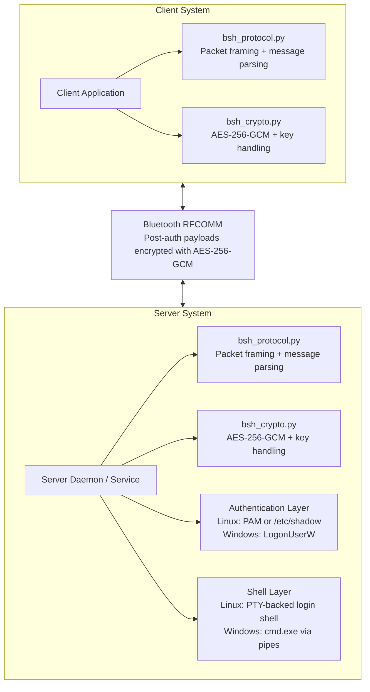
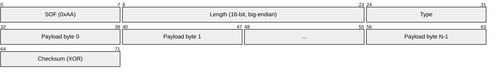
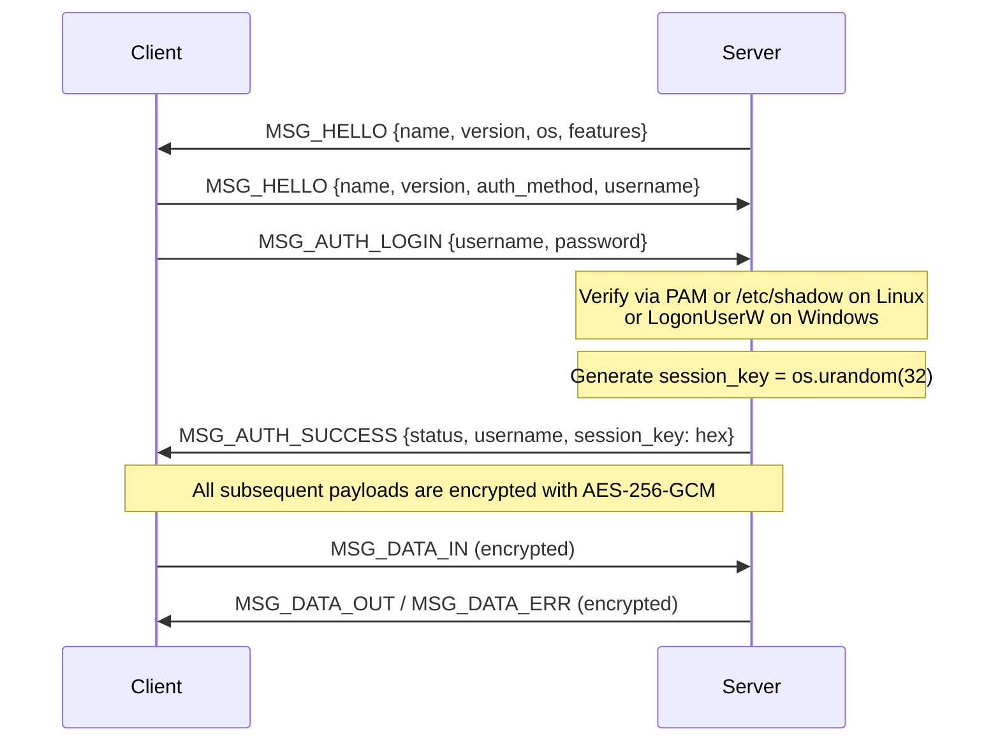
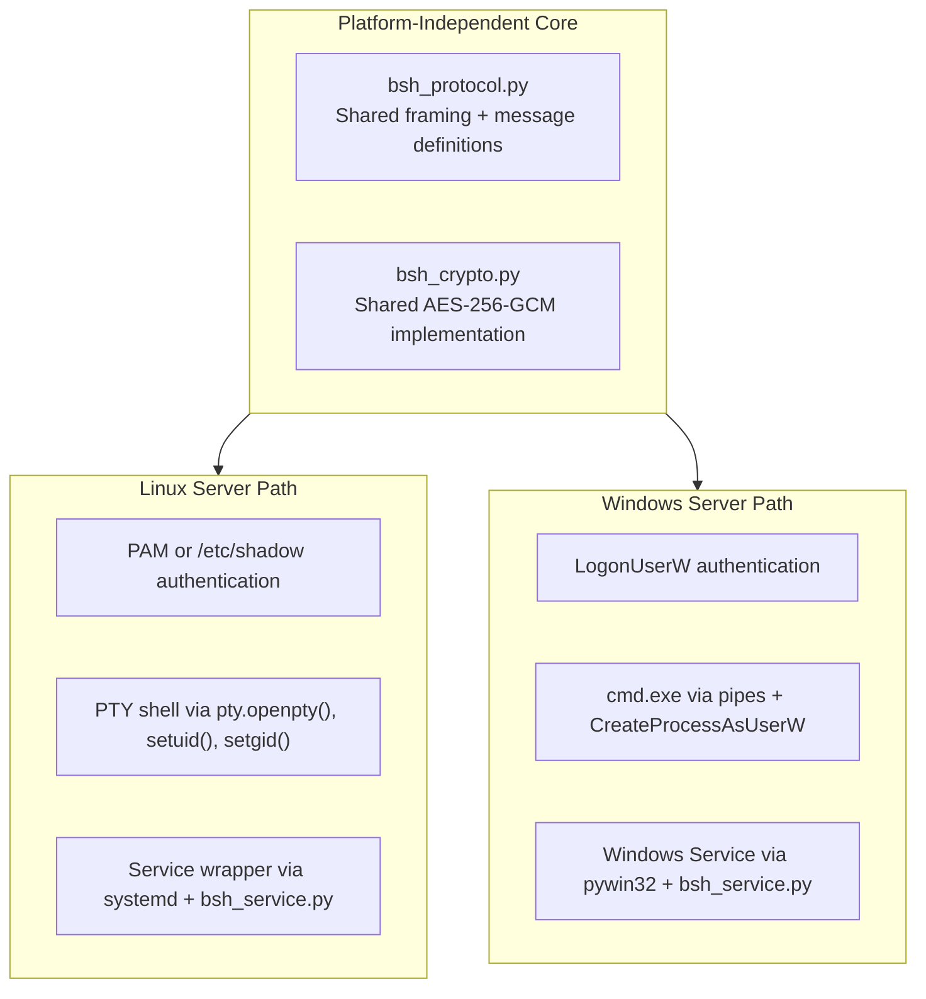
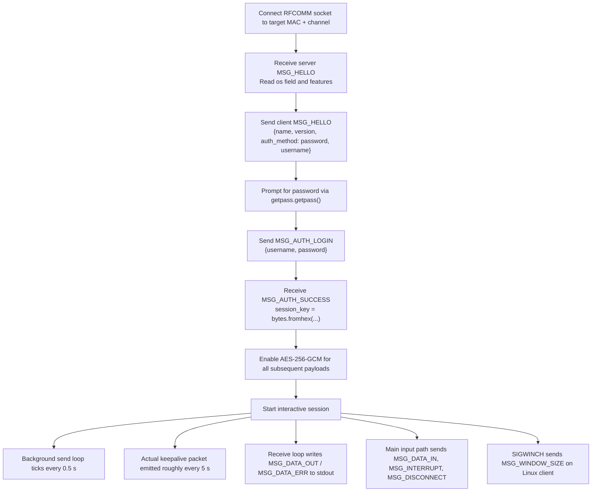
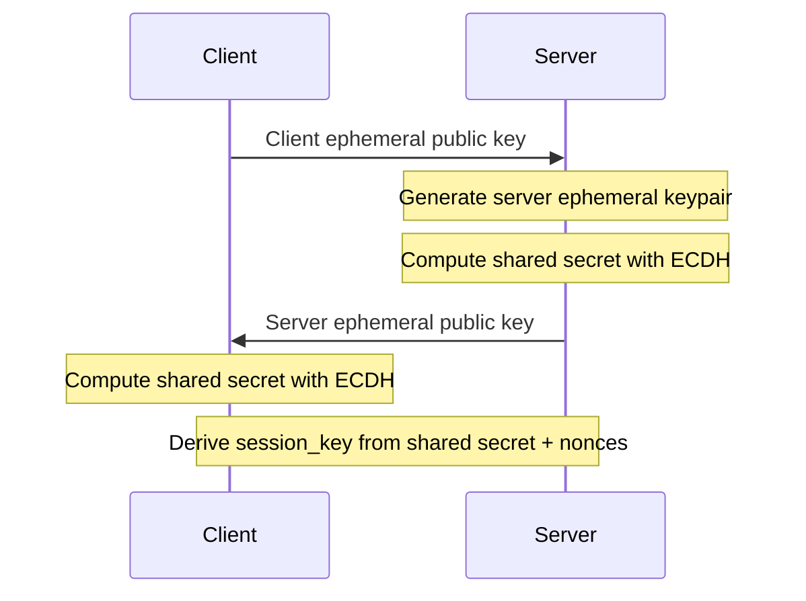
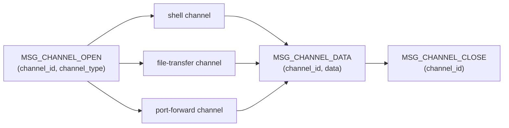
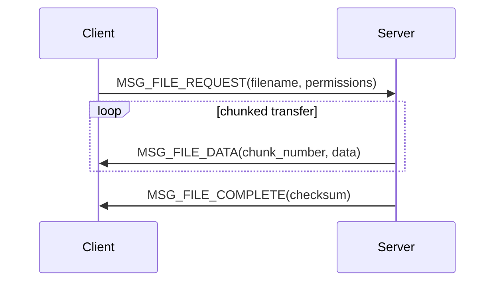

# OpenBSH: A Secure Cross-Platform Bluetooth Shell Protocol for Out-of-Band System Administration

## Abstract

Network-based remote administration tools face significant challenges in air-gapped environments, network failures, and emergency recovery scenarios. We present OpenBSH (Open Bluetooth Shell), a secure remote shell protocol operating over Bluetooth RFCOMM that provides SSH-like functionality for out-of-band system management. OpenBSH implements a custom wire protocol with AES-256-GCM encryption, cross-platform authentication integration (PAM on Linux, Windows Security API), and interactive shell transport with Linux PTY support and Windows pipe-based console I/O. The system architecture cleanly separates cryptographic operations from platform-specific implementations, enabling consistent protocol behavior across Windows and Linux deployments. Our implementation demonstrates that Bluetooth can serve as a viable proximity-based management channel for scenarios where network access is unavailable, compromised, or deliberately restricted. We present the protocol design, security architecture, implementation details, and practical deployment considerations grounded in the current code base.

**Keywords:** Bluetooth security, remote administration, out-of-band management, cryptographic protocols, cross-platform security, RFCOMM, authenticated encryption

---

## 1. Introduction

### 1.1 Motivation

Modern system administration heavily relies on network-based remote access protocols, particularly SSH (Secure Shell). However, several critical scenarios expose fundamental limitations of network-dependent management:

1. **Air-Gapped Environments**: High-security facilities deliberately isolate systems from networks
2. **Network Failure Recovery**: Misconfigurations or attacks can lock administrators out of network access
3. **Emergency Management**: Physical proximity to systems without functioning network infrastructure
4. **Zero-Trust Boundaries**: Need for alternative authentication channels independent of potentially compromised network infrastructure

Traditional out-of-band management solutions (IPMI, iLO, DRAC) require dedicated hardware and network infrastructure, making them expensive and still network-dependent. Serial console access requires physical cabling and lacks modern security features.

### 1.2 Contributions

This paper presents OpenBSH, a secure Bluetooth-based remote shell system that addresses these limitations. Our key contributions include:

1. **Novel Wire Protocol**: A custom framing protocol over Bluetooth RFCOMM with integrated cryptographic primitives designed for reliable stream-based communication
2. **Hybrid Security Model**: Post-authentication AES-256-GCM encryption combined with platform-native authentication (PAM, Windows Security API)
3. **Cross-Platform Architecture**: Unified cryptographic core with platform-specific integration, maintaining security invariants across operating systems
4. **Practical Implementation**: Implementations for Windows (as a Windows Service) and Linux (as a systemd daemon), with Linux PTY integration and Windows pipe-based shell I/O

### 1.3 Scope and Limitations

OpenBSH is designed for **proximity-based trusted administration** scenarios. The threat model assumes:
- Physical proximity (Bluetooth range ~10-100m)
- Trusted client devices
- Pre-established device pairing (Bluetooth pairing)
- Protection against passive eavesdropping and active tampering *after* authentication

OpenBSH is **not** designed to replace SSH for network-based remote administration or to provide anonymity/location privacy. The protocol operates within Bluetooth security constraints and assumes proper Bluetooth pairing procedures.

### 1.4 Paper Organization

Section 2 reviews related work in remote administration and Bluetooth security. Section 3 presents the OpenBSH protocol architecture and cryptographic design. Section 4 details the security model and threat analysis. Section 5 describes the cross-platform implementation. Section 6 discusses practical deployment considerations. Section 7 outlines future work. Section 8 concludes.

---

## 2. Related Work

### 2.1 Remote Administration Protocols

**SSH (Secure Shell)**: The de facto standard for secure remote administration, SSH provides strong cryptographic security and extensive authentication options. However, SSH is entirely network-dependent and cannot function when network access is unavailable or compromised.

**Serial Console Access**: Traditional serial consoles provide out-of-band access but lack modern security features (no encryption, weak or no authentication) and require physical cabling, limiting mobility and scalability.

**IPMI/BMC Solutions**: Intelligent Platform Management Interface and Baseboard Management Controllers (BMC) provide out-of-band management but require dedicated hardware, separate network infrastructure, and have suffered from numerous security vulnerabilities [cite: IPMI security issues].

### 2.2 Bluetooth Security

**Bluetooth Security Architecture**: The Bluetooth specification includes pairing mechanisms (PIN, SSP), link-layer encryption, and authentication [cite: Bluetooth Core Specification]. However, these provide only transport-layer security and do not address application-level security requirements.

**Bluetooth Vulnerabilities**: Historical attacks on Bluetooth include BlueBorne and various pairing attacks [cite: BlueBorne, Bluetooth security surveys]. These emphasize the need for application-layer protections in addition to Bluetooth's built-in security.

**Bluetooth in IoT Security**: Recent work has explored Bluetooth for IoT device management [cite: relevant papers], but these typically focus on resource-constrained devices rather than full-featured system administration.

### 2.3 Out-of-Band Authentication

Out-of-band (OOB) channels have been studied for authentication in various contexts [cite: OOB authentication papers], particularly for initial trust establishment. OpenBSH uses Bluetooth as the primary communication channel rather than just for initial authentication.

### 2.4 Gap Analysis

No existing solution provides:
- Secure shell access over Bluetooth with modern cryptography
- Cross-platform implementation with unified security model
- Interactive shell access over Bluetooth, including Linux PTY support
- Integration with native OS authentication systems

OpenBSH fills this gap by combining a dedicated application protocol with Bluetooth transport, providing a practical solution for out-of-band system administration.

---

## 3. OpenBSH Protocol Design

### 3.1 Architecture Overview

OpenBSH consists of three primary components:

1. **Wire Protocol Layer** (`bsh_protocol.py`): Handles packet framing, message types, and checksum validation
2. **Cryptographic Layer** (`bsh_crypto.py`): Implements AES-256-GCM encryption/decryption and session key management
3. **Platform Integration Layer**: OS-specific authentication and shell management



### 3.2 Wire Protocol Specification

Bluetooth RFCOMM provides a reliable byte stream similar to TCP. OpenBSH implements a custom framing protocol to delimit packet boundaries.

#### 3.2.1 Packet Structure

Each OpenBSH packet follows this binary format:



- **Start of Frame (SOF)**: Fixed byte `0xAA` for synchronization
- **Length**: 16-bit unsigned integer (big-endian) indicating payload size
- **Type**: 8-bit message type identifier
- **Payload**: Variable-length message data
- **Checksum**: Single-byte XOR checksum

The checksum is calculated as an XOR over the 2 Length bytes, the Type byte, and all Payload bytes. The SOF byte (`0xAA`) is intentionally excluded from the checksum. This is reflected directly in `BSHPacket._checksum()`:

```python
def _checksum(self, length: int) -> int:
    cs = (length >> 8) & 0xFF
    cs ^= length & 0xFF
    cs ^= int(self.msg_type)
    for b in self.payload:
        cs ^= b
    return cs & 0xFF
```

The serialized wire format is packed via `struct.pack('!BHB', SOF, length, msg_type)`, confirming the 1B+2B+1B header layout (4 bytes total before payload).

#### 3.2.2 Message Types

The following message types are defined in `MessageType(IntEnum)` in `bsh_protocol.py` (shared across all platforms):

| Code | Name | Direction | Description |
|------|------|-----------|-------------|
| 0x01 | MSG_HELLO | Bidirectional | Capability exchange |
| 0x02 | MSG_DISCONNECT | Bidirectional | Clean disconnect |
| 0x03 | MSG_KEEPALIVE | Bidirectional | Connection maintenance |
| 0x07 | MSG_AUTH_SUCCESS | Server → Client | Authentication success + session key |
| 0x08 | MSG_AUTH_FAILURE | Server → Client | Authentication failure |
| 0x09 | MSG_AUTH_LOGIN | Client → Server | Username and plaintext password |
| 0x10 | MSG_DATA_IN | Client → Server | Shell input (encrypted) |
| 0x11 | MSG_DATA_OUT | Server → Client | Shell output (encrypted) |
| 0x12 | MSG_DATA_ERR | Server → Client | Shell error output (encrypted) |
| 0x15 | MSG_WINDOW_RESIZE | Client → Server | Terminal resize (alternate code) |
| 0x20 | MSG_INTERRUPT | Client → Server | Interrupt signal (Ctrl+C) |
| 0x21 | MSG_WINDOW_SIZE | Client → Server | Terminal window size |

> **Note**: Two message type codes exist for terminal resize — `MSG_WINDOW_SIZE` (0x21) and `MSG_WINDOW_RESIZE` (0x15). Both are handled identically in the server's `start_shell_session` loop; `MSG_WINDOW_RESIZE` is an alternate code accepted for compatibility.

### 3.3 Cryptographic Protocol

#### 3.3.1 Encryption Algorithm

OpenBSH uses **AES-256-GCM** (Galois/Counter Mode) for authenticated encryption, providing:
- **Confidentiality**: 256-bit AES encryption
- **Authenticity**: 128-bit authentication tag prevents tampering
- **Resistance to replay**: Unique IV per packet

The implementation uses the Python `cryptography` library (`cryptography.hazmat.primitives.ciphers`), which is identical across Linux, Windows, and client code (`linux/bsh_crypto.py`, `windows/bsh_crypto.py`, `Client/bsh_crypto.py`).

#### 3.3.2 Key Derivation and Management

**PBKDF2 Key Derivation** (used for standalone password hashing, not session keys):
```python
kdf = PBKDF2HMAC(
    algorithm=hashes.SHA256(), length=32, salt=salt,
    iterations=100_000, backend=self.backend,
)
key, salt = kdf.derive(password), salt
```
- Salt: 16 bytes of `os.urandom(16)`
- Output: 32-byte key

**Session Key Generation**: Upon successful authentication, the server generates a fresh 256-bit session key:
```python
session_key = os.urandom(32)  # 256 bits of cryptographic randomness
```

The session key is transmitted to the client as a hex-encoded string in the `MSG_AUTH_SUCCESS` JSON payload:
```json
{"status": "authenticated", "username": "<user>", "session_key": "<64-char hex>"}
```

#### 3.3.3 Packet Encryption Format

After authentication, all packet payloads are encrypted. The wire format returned by `BSHCrypto.encrypt_data()` is:

```
Encrypted Payload = IV(12 B) || Ciphertext(N B) || GCM Auth Tag(16 B)
```

```python
def encrypt_data(self, key: bytes, plaintext: bytes) -> bytes:
    iv  = os.urandom(12)
    enc = Cipher(algorithms.AES(key), modes.GCM(iv), backend=self.backend).encryptor()
    ct  = enc.update(plaintext) + enc.finalize()
    return iv + ct + enc.tag   # 12 + N + 16 bytes

def decrypt_data(self, key: bytes, encrypted: bytes) -> bytes:
    iv, tag, ct = encrypted[:12], encrypted[-16:], encrypted[12:-16]
    dec = Cipher(algorithms.AES(key), modes.GCM(iv, tag), backend=self.backend).decryptor()
    return dec.update(ct) + dec.finalize()
```

**Critical Security Property**: Each packet uses a unique IV generated via `os.urandom(12)`, ensuring no IV reuse (which would be catastrophic for GCM security).

### 3.4 Authentication Protocol

#### 3.4.1 Authentication Flow

The actual authentication flow implemented in the code is as follows. Note that the **server sends `MSG_HELLO` first**, and the **username is included in the client's `MSG_HELLO` payload** as well as in `MSG_AUTH_LOGIN`:



The server-side `handle_client()` reads `username` and `auth_method` from the client `MSG_HELLO`. If `auth_method` is not `'password'`, the connection is refused immediately. The subsequent `MSG_AUTH_LOGIN` packet carries a JSON body with `{"username": ..., "password": ...}`.

#### 3.4.2 Authentication Methods

OpenBSH supports **one primary authentication mode** per platform:

1. **Linux — OS Authentication** (PAM preferred, `/etc/shadow` fallback):
   ```python
   # Primary: python-pam
   result = self._pam.authenticate(username, password, service='login')
   
   # Fallback (requires root + spwd module):
   computed = crypt.crypt(password, stored)
   result = hmac.compare_digest(computed, stored)
   ```
   `spwd` (the shadow module) was removed in Python 3.13; the code logs an error if it is unavailable.

2. **Windows — Windows Security API**:
   ```python
   result = self.advapi32.LogonUserW(
       username, None, password,
       LOGON32_LOGON_INTERACTIVE, LOGON32_PROVIDER_DEFAULT,
       ctypes.byref(token),
   )
   ```
   The `domain` parameter is passed as `None`, meaning Windows resolves the account against the local SAM database by default. Domain-joined behaviour is subject to the host's own account resolution rules.


### 3.5 Session Management

#### 3.5.1 Connection Lifecycle

1. **Initial Handshake**: Client sends `MSG_HELLO` (with `username` and `auth_method`); server responds with its own `MSG_HELLO` (with `os` field and `features` list)
2. **Authentication**: Client sends `MSG_AUTH_LOGIN` with plaintext `username` and `password`
3. **Session Key Exchange**: Server sends `MSG_AUTH_SUCCESS` with a hex-encoded 32-byte session key; encryption activates immediately for all subsequent packets
4. **Keepalive**: The client's background sender loop wakes every **0.5 seconds**, but an actual `MSG_KEEPALIVE` packet is emitted roughly every **5 seconds**. The server also sets a socket timeout of 0.5 seconds to interleave keepalive checks without blocking indefinitely.
5. **Termination**: `MSG_DISCONNECT` or connection error


#### 3.5.2 Terminal Emulation

OpenBSH provides an interactive shell transport with platform-specific terminal handling:

**Linux Server**: Uses `pty.openpty()` to create a master/slave PTY pair. The child process receives the slave FD as its controlling terminal via `os.setsid()` + `fcntl.ioctl(slave_fd, termios.TIOCSCTTY, 0)`. The server's main loop uses `select.select()` on the master FD for non-blocking I/O.

**Windows Server**: Spawns `cmd.exe` with pipe-based stdin/stdout/stderr redirection via `CreatePipe` and either `CreateProcessAsUserW` (when running as SYSTEM) or `subprocess.Popen` (when running as Administrator). There is no Windows PTY (ConPTY) in the current implementation.

**Terminal Features**:
- Window size synchronization via `MSG_WINDOW_SIZE` (0x21) and `MSG_WINDOW_RESIZE` (0x15) — both handled identically in the server loop
- Linux PTY resize applied via `fcntl.ioctl(master_fd, termios.TIOCSWINSZ, ...)`
- Windows server accepts `MSG_WINDOW_SIZE` / `MSG_WINDOW_RESIZE` but does not apply them (no PTY)
- Signal handling: `MSG_INTERRUPT` → `os.kill(child_pid, signal.SIGINT)` on Linux; `WriteFile(stdin_write, b'\x03')` on Windows
- Echo control: client-side raw mode on Linux (remote PTY handles echo); client-side line buffer on Windows

---

## 4. Security Analysis

### 4.1 Threat Model

#### 4.1.1 Assumptions

**Physical Security**: Attacker is within Bluetooth range (~10-100m depending on class)

**Trusted Endpoints**: Client and server devices are trusted (no malware)

**Bluetooth Pairing**: Devices have completed secure Bluetooth pairing (SSP recommended)

**Authentication**: User has legitimate credentials for the target system

#### 4.1.2 Threat Classes

We consider the following threat classes:

1. **Passive Eavesdropping**: Attacker monitors Bluetooth traffic
2. **Active Tampering**: Attacker modifies packets in transit
3. **Replay Attacks**: Attacker captures and replays valid packets
4. **Man-in-the-Middle**: Attacker intercepts and relays traffic
5. **Brute Force**: Attacker attempts to guess credentials
6. **Protocol Exploitation**: Attacker exploits protocol weaknesses

### 4.2 Security Properties

#### 4.2.1 Confidentiality

**Property**: All post-authentication traffic is encrypted with AES-256-GCM

**Analysis**: AES-256 is currently considered secure against all known attacks when properly implemented. The 256-bit key space (2^256 ≈ 1.16×10^77) makes brute force infeasible.

**Limitation**: Pre-authentication messages (`MSG_HELLO`, `MSG_AUTH_LOGIN`) are transmitted in plaintext at the application layer.

**Critical Issue**: The password in `MSG_AUTH_LOGIN` is sent *before* session key establishment. This means the password traverses the Bluetooth link without application-layer encryption, relying solely on Bluetooth link-layer security.

**Mitigation**: Bluetooth pairing provides link-layer encryption. For maximum security, SSP (Secure Simple Pairing) should be used.

#### 4.2.2 Authenticity and Integrity

**Property**: AES-GCM provides authenticated encryption with 128-bit authentication tags

**Analysis**: The GCM authentication tag prevents tampering. Any modification to ciphertext, IV, or associated data will cause authentication failure and connection termination. The probability of successful forgery is 2^-128 ≈ 2.94×10^-39 per attempt.

**Checksum**: The wire protocol includes an additional XOR checksum over the Length, Type, and Payload bytes (SOF excluded), providing basic error detection for the packet framing layer before decryption.

#### 4.2.3 Replay Protection

**Property**: Unique IV per packet prevents replay attacks

**Analysis**: Each packet uses a fresh 12-byte IV generated via `os.urandom()`. The probability of IV collision is negligible (2^-96 ≈ 1.26×10^-29 per pair). Even if an attacker captures and replays a valid encrypted packet, the application context prevents meaningful exploitation.

**Limitation**: No explicit sequence numbers or timestamps. However, the stateful nature of shell sessions and unique IVs provide practical replay protection.

#### 4.2.4 Forward Secrecy

**Limitation**: OpenBSH does **not** provide perfect forward secrecy. The session key is generated server-side and transmitted in plaintext (application-layer) inside `MSG_AUTH_SUCCESS`, before any application-layer encryption is active. This means the session key itself is exposed on the Bluetooth link-layer channel during transmission.

**Impact**: If the Bluetooth link-layer encryption is compromised and traffic is recorded, an attacker could read the session key from `MSG_AUTH_SUCCESS` and subsequently decrypt the entire session.

**Mitigation Strategy**: This design choice prioritizes simplicity and performance for the target use case. Future versions could incorporate ECDH key exchange.

#### 4.2.5 Authentication Security

**Strengths**:
- PBKDF2 with 100,000 iterations available for standalone password hashing
- Integration with OS authentication leverages platform security features (PAM, Windows LogonUser)

**Weaknesses**:
- Password transmitted in `MSG_AUTH_LOGIN` before session key is active (no application-layer encryption at that point)
- No rate limiting at the protocol level (relies on server OS and Bluetooth pairing)
- No brute-force protection beyond OS-level account lockout policies

### 4.3 Attack Analysis

#### 4.3.1 Passive Eavesdropping

**Attack**: Attacker captures Bluetooth traffic

**Defense**:
- Bluetooth pairing provides link-layer encryption
- Post-authentication traffic encrypted with AES-256-GCM
- Even if link-layer compromised, session traffic remains encrypted

**Effectiveness**: High protection for session data; limited protection for pre-authentication exchanges (HELLO, AUTH_LOGIN)

#### 4.3.2 Active Tampering

**Attack**: Attacker modifies packets in transit

**Defense**:
- GCM authentication tag detects any modification
- Connection immediately terminated on authentication failure
- XOR checksum provides additional integrity check at the framing layer

**Effectiveness**: Very high protection — tampering is detected and rejected

#### 4.3.3 Man-in-the-Middle

**Attack**: Attacker intercepts and relays traffic

**Defense**:
- Requires compromising Bluetooth pairing (challenging with SSP numeric comparison)
- Application-layer encryption independent of transport

**Limitation**: Without public key infrastructure, MITM at pairing stage is possible

**Mitigation**: Bluetooth SSP with numeric comparison provides strong MITM protection

#### 4.3.4 Protocol Downgrade

**Attack**: Attacker forces use of weak cryptography

**Defense**:
- Single cipher suite (AES-256-GCM) — no negotiation, no downgrade possible
- Only `auth_method: 'password'` is accepted; any other value is rejected immediately

**Effectiveness**: Complete protection — no algorithm negotiation to attack

### 4.4 Comparison with SSH

| Security Property | SSH | OpenBSH |
|-------------------|-----|---------| 
| Encryption | AES-128/256, ChaCha20 | AES-256-GCM only |
| Authentication | Multiple (password, pubkey, etc.) | Password + OS auth (PAM/LogonUser) |
| Forward Secrecy | Yes (Diffie-Hellman) | No (session key sent in plaintext before encryption) |
| MITM Protection | Host key verification | Bluetooth pairing |
| Replay Protection | Sequence numbers | Unique IV per packet |
| Transport | TCP/IP | Bluetooth RFCOMM |
| Range | Network (unlimited) | Bluetooth (~10-100m) |

**Key Difference**: SSH provides stronger cryptographic properties (forward secrecy, explicit MITM protection), but OpenBSH offers availability in non-network scenarios — a fundamentally different value proposition.

### 4.5 Security Recommendations

For production deployment:

1. **Mandatory Bluetooth Pairing**: Enforce SSP (Secure Simple Pairing) with numeric comparison
2. **Rate Limiting**: Implement authentication attempt limits at the OS level
3. **Audit Logging**: Log all authentication attempts and session activities (service logs to `/var/log/bsh/` on Linux, `C:\ProgramData\BSH\logs\` on Windows)
4. **Network Isolation**: Disable network interfaces when relying on Bluetooth-only access
5. **Future Enhancement**: Add ECDH key exchange for forward secrecy

---

## 5. Implementation

### 5.1 Cross-Platform Architecture

OpenBSH achieves cross-platform consistency through careful architectural separation:



The `bsh_protocol.py` and `bsh_crypto.py` files are kept in **three copies**: `linux/`, `windows/`, and `Client/`. They are intended to be kept byte-for-byte identical across all three locations.

This design ensures:
- **Cryptographic uniformity**: Identical security properties on all platforms
- **Protocol consistency**: Same wire format and message semantics
- **Platform optimization**: Native OS features for best performance/integration

### 5.2 Linux Implementation

#### 5.2.1 Service Architecture

**Deployment Model**: systemd service unit (`bsh.service`) managed via `bsh_service.py`

**Privilege Model**: Must run as root (UID 0) for PAM integration and `setuid`/`setgid` user impersonation

**Runtime Files**:
- Service log: `/var/log/bsh/bsh_service.log`
- Runtime state (bound channel, PID): `/run/bsh/runtime.json`
- Config file: `/etc/bsh/config.json` (optional; defaults in `bsh_service.py`)
- Data directory: `/var/lib/bsh/`

**Bluetooth Stack**: Uses Python stdlib `socket.AF_BLUETOOTH` / `socket.BTPROTO_RFCOMM` directly. PyBluez (`bluetooth.BluetoothSocket`) is used when available for SDP advertisement; falls back to the `sdptool` CLI tool; and if that also fails, logs a warning that clients must connect by explicit channel number. The BSH service UUID is `B5E7DA7A-0B53-1000-8000-00805F9B34FB`.

**Channel Binding**: Attempts to bind to the requested channel (default: 1). If that channel is in use (`errno 98`), scans channels 1–30 in order.

**PTY Implementation**:
- Uses `pty.openpty()` for master/slave terminal pair
- Child process: `os.setsid()` + `fcntl.ioctl(slave_fd, termios.TIOCSCTTY, 0)` to set controlling terminal
- Master FD for server I/O, slave FD for child shell process
- Non-blocking I/O with `select.select([master_fd], [], [], 0.05)` for output polling
- Window resize via `fcntl.ioctl(master_fd, termios.TIOCSWINSZ, ...)`
- Signal handling: `SIGTERM` for graceful shutdown; `SIGINT` forwarded to child via `os.kill(child_pid, signal.SIGINT)`

#### 5.2.2 Authentication Flow

1. **PAM Integration** (Primary — requires `python-pam` package):
   ```python
   import pam
   pam_auth = pam.pam()
   success = pam_auth.authenticate(username, password, service='login')
   ```

2. **Shadow File Fallback** (when PAM unavailable — requires root + `spwd` module):
   ```python
   import spwd, crypt, hmac
   entry  = spwd.getspnam(username)
   stored = entry.sp_pwdp
   computed = crypt.crypt(password, stored)
   result = hmac.compare_digest(computed, stored)
   ```
   > **Note**: `spwd` was removed in Python 3.13. The code logs an explicit error if it is unavailable. `hmac.compare_digest()` is used (not `==`) to prevent timing attacks.

#### 5.2.3 User Impersonation

When running as root, the shell child process drops privileges before exec:
```python
os.setgroups(supp_groups)   # supplementary groups
os.setgid(gid)              # primary group
os.setuid(uid)              # user ID
```
The user's login shell (from `pw.pw_shell`) is exec'd as a login shell (`-bash`, `-sh`, etc.) with a clean environment (`HOME`, `USER`, `LOGNAME`, `SHELL`, `TERM`, `LANG`, `PATH`).

### 5.3 Windows Implementation

#### 5.3.1 Service Architecture

**Deployment Model**: Native Windows Service via `pywin32` (`win32serviceutil.ServiceFramework`), managed through `bsh_service.py`

**Service Name**: `BSHService` / display name: `BSH Bluetooth Shell Service`

**Privilege Model**: Runs as `LocalSystem` (`NT AUTHORITY\SYSTEM`). The following privileges are requested via the `RequiredPrivileges` registry value:
- `SeAssignPrimaryTokenPrivilege` — spawn processes as other users
- `SeIncreaseQuotaPrivilege` — adjust process memory quotas
- `SeTcbPrivilege` — act as part of the OS

**Runtime Files**:
- Service log: `C:\ProgramData\BSH\logs\bsh_service.log`
- Runtime state: `C:\ProgramData\BSH\runtime.json`
- Config file: `C:\ProgramData\BSH\config.json` (optional; defaults in `bsh_service.py`)

**Bluetooth Stack**: Uses raw Winsock2 via `ctypes.windll.ws2_32` with `AF_BTH = 32` and `BTHPROTO_RFCOMM = 3`. SDP advertisement uses `WSASetServiceW` with the BSH service UUID.

**Channel Binding**: Attempts to bind to the requested channel. Uses `BT_PORT_ANY` (`0xFFFFFFFF`) only when `channel == 0`; otherwise uses the requested channel directly.

#### 5.3.2 Process Impersonation

Windows implementation uses token-based impersonation:

1. **Authenticate**: `LogonUserW` with `LOGON32_LOGON_INTERACTIVE` validates credentials and returns a user token
2. **Shell launch** (SYSTEM context): `CreateProcessAsUserW` with the user token, loading user profile via `LoadUserProfileW` and creating an environment block via `CreateEnvironmentBlock`
3. **Shell launch** (non-SYSTEM, plain Administrator): `subprocess.Popen(['cmd.exe'], stdin=PIPE, stdout=PIPE, stderr=STDOUT)` — no impersonation
4. **I/O**: Pipe-based (`CreatePipe`) stdin/stdout/stderr — there is no Windows PTY (ConPTY) in the current implementation

**Security Context**: When running as SYSTEM, the shell runs with the privileges of the authenticated user, not SYSTEM.

**Ctrl+C**: Implemented by writing `b'\x03'` directly to the stdin pipe (not `GenerateConsoleCtrlEvent`, which could affect the server process group).

### 5.4 Client Implementation

#### 5.4.1 Platform-Specific Considerations

OpenBSH provides two client scripts: `bsh_client_linux.py` and `bsh_client_windows.py`. Each implements a dynamic, dual-mode architecture that adapts its terminal input model based on the target server's operating system (advertised in the `MSG_HELLO` payload as the `os` field).

**Linux Client (to Linux Server — Native PTY)**:
- Switches stdin to raw mode via `termios.tcsetattr(stdin_fd, termios.TCSANOW, raw_settings)`
- Forwards every keystroke character-by-character as `MSG_DATA_IN`
- The remote Linux PTY line discipline handles echo, backspace, and canonical editing
- `SIGWINCH` handler sends `MSG_WINDOW_SIZE` on terminal resize

**Linux Client (to Windows Server — Pipe-based)**:
- Falls back to a Windows-compatible local editing path
- Intercepts control keys (arrow keys, Home, End, Del, Backspace) client-side using escape sequence parsing
- Maintains a local line buffer (`win_buffer`) and command history (`win_history`)
- Sends the complete line (buffer + `\r\n`) only when Enter is pressed

**Windows Client (to Windows Server — Pipe-based)**:
- Uses local line-buffered editing with command history
- ANSI escape codes used to implement local cursor movement and line redrawing

**Windows Client (to Linux Server — Native PTY)**:
- Disables local echo; forwards keystrokes character-by-character
- Relies on the remote Linux PTY to echo characters back via `MSG_DATA_OUT`

#### 5.4.2 Connection and Authentication Flow



#### 5.4.3 Cross-Platform Compatibility Matrix

| Pair | Server OS Field | Actual Shell Backend | Editing Authority | `MSG_WINDOW_SIZE` Handling |
|---|---|---|---|---|
| Windows Client → Windows Server | `Windows` | `cmd.exe` via pipes | Client-side line editor | Sent, but ignored by server |
| Windows Client → Linux Server | `Linux` | PTY-backed login shell | Remote Linux PTY | Applied via `TIOCSWINSZ` |
| Linux Client → Windows Server | `Windows` | `cmd.exe` via pipes | Client-side line editor | Sent, but ignored by server |
| Linux Client → Linux Server | `Linux` | PTY-backed login shell | Remote Linux PTY | Applied via `TIOCSWINSZ` |

#### 5.4.4 SDP Channel Discovery (Linux Client)

The Linux client implements a three-tier channel discovery strategy:
1. **PyBluez SDP** (`bt.find_service()`) — queries BSH UUID, then SPP UUID as fallback
2. **`sdptool browse`** — parses output for RFCOMM channel lines
3. **Channel scan** — connects to channels 1–12 with a 3-second timeout each
4. **Manual entry** — if all else fails, prompts the user

### 5.5 Error Handling and Robustness

#### 5.5.1 Connection Management

- **Keepalive Mechanism**: The client uses a dedicated daemon thread whose sender loop wakes every 0.5 seconds, while `MSG_KEEPALIVE` packets are emitted roughly every 5 seconds. Server socket timeout is also set to 0.5 seconds so the shell-exit check loop doesn't block between wakeups.
- **Timeout Detection**: The server's `_recv_exact()` re-raises `socket.timeout` so that the outer `start_shell_session` loop can `continue` rather than treating a timeout as a disconnect
- **Graceful Shutdown**: `MSG_DISCONNECT` allows clean termination
- **Checksum failures**: `BSHPacket.from_bytes()` returns `None` on checksum mismatch; the server drops the packet and the session terminates

#### 5.5.2 Cryptographic Error Handling

- **GCM Tag Failure**: `crypto.decrypt_data()` raises `cryptography.exceptions.InvalidTag`; the server catches this, logs a warning, and returns `None` (causing session termination)
- **Nonce Generation**: Each encrypted payload carries a fresh random 12-byte IV from the sender
- **Session Key Lifetime**: Session keys are generated per connection in `authenticate_password()` and cleared (set to `None`) in `handle_client()`'s `finally` block on disconnect. The `_encrypted` flag is also reset to `False`.

---

## 6. Practical Deployment

### 6.1 Evidence Boundaries

The current repository provides an implementation and operational documentation, but it does not include a reproducible benchmark harness, published measurement dataset, or automated performance-reporting pipeline. This section focuses on implementation-backed deployment observations rather than synthetic benchmark claims.

### 6.2 Operational Characteristics

Based on the code base, OpenBSH is best understood as a proximity-oriented administrative channel optimized for:

- Interactive shell access rather than bulk transfer
- Recovery and emergency access rather than continuous daily administration
- Small administrative payloads such as commands, logs, service status, and configuration changes

Several implementation properties shape these characteristics:

- Bluetooth RFCOMM is the transport, so session setup and I/O behavior are bounded by Bluetooth stack behavior and radio conditions
- Every encrypted application payload carries 12-byte IV and 16-byte authentication-tag overhead
- The Linux implementation supports terminal-oriented workflows through a real PTY (including `vim`, `htop`, etc.)
- The Windows implementation provides an interactive shell through redirected pipes rather than a true PTY abstraction

### 6.3 Practical Positioning

OpenBSH should be positioned as a complementary tool, not a replacement for SSH or other network-native administration systems. Its main advantage is availability when IP networking is absent or intentionally unavailable. Its trade-offs are shorter range, lower expected throughput than typical LAN-based management, and a current authentication design that still depends on Bluetooth link-layer protection during password submission.

### 6.4 Measurement Status

No repository-backed benchmark data is currently published for cryptographic throughput, CPU utilization, or memory footprint. Any future performance section should be supported by a disclosed test plan, captured raw results, and reproducible scripts.

---

### 6.5 Use Case Scenarios

#### 6.5.1 Data Center Emergency Access

**Scenario**: Network misconfiguration locks out administrators from production servers

**Solution**: OpenBSH provides proximity-based access without requiring network connectivity

**Deployment**:
- Install OpenBSH on all critical servers
- Administrators carry laptops with Bluetooth client
- Physical data center access + Bluetooth range = emergency administrative access

**Advantages**:
- No network dependency
- No specialized hardware (IPMI/iLO)
- Encrypted communication
- Full shell access for recovery operations

#### 6.5.2 Air-Gapped Secure Environments

**Scenario**: High-security facility with isolated systems (defense, finance, research)

**Solution**: OpenBSH enables administration without network bridges

**Deployment**:
- Servers completely isolated from networks
- Bluetooth-only access for authorized administrators
- Physical proximity requirement enhances security

**Advantages**:
- Maintains air-gap integrity
- No network exfiltration paths
- Audit logging of physical proximity access
- Modern shell experience vs. serial console

#### 6.5.3 IoT/Edge Device Management

**Scenario**: Edge devices in industrial or remote locations with unreliable networks

**Solution**: Bluetooth-based management as backup channel

**Deployment**:
- Raspberry Pi or similar devices with Bluetooth
- Field technician access without network setup
- On-site troubleshooting and configuration

**Advantages**:
- No WiFi credentials needed
- Works when network is down or misconfigured
- Encrypted access vs. unencrypted serial

### 6.6 Deployment Best Practices

#### 6.6.1 Security Hardening

1. **Bluetooth Pairing**:
   - Use Secure Simple Pairing (SSP) with numeric comparison
   - Document paired devices
   - Regularly audit paired device list

2. **Authentication**:
   - Use strong OS account passwords (BSH uses the OS credential store directly)
   - Enforce strong password policies at the OS level
   - Leverage OS account lockout policies for brute-force protection (BSH itself has no rate limiting)

3. **Access Control**:
   - Limit BSH-accessible accounts to specific administrative users
   - Use OS-level authorization (sudo, UAC) for privileged operations
   - Enable comprehensive audit logging

4. **Physical Security**:
   - Remember: Bluetooth range = physical proximity requirement
   - Secure physical access to areas within Bluetooth range
   - Consider Bluetooth class 2 (10m) vs class 1 (100m) range implications

#### 6.6.2 Operational Procedures

1. **Monitoring**:
   - Log all connection attempts (successful and failed)
   - Alert on authentication failures
   - Monitor for unusual connection patterns

2. **Incident Response**:
   - Procedures for disabling BSH service in emergency
   - Bluetooth adapter disabling for complete lockdown
   - Forensic logging for security investigations

3. **Maintenance**:
   - Regular security updates to dependencies (`cryptography`, `pywin32`, `python-pam`)
   - Periodic password rotation on OS accounts
   - Review and update paired device list

### 6.7 Integration Considerations

#### 6.7.1 Enterprise Directory Services

**Windows Account Validation**:
- The Windows service validates credentials through `LogonUserW` with `domain=None`
- In domain-joined environments, Windows resolves accounts against the local SAM or domain depending on the username format supplied (`user` vs. `DOMAIN\user`)
- Password policy enforcement remains the responsibility of the underlying Windows account system

**LDAP Integration** (Linux):
- PAM LDAP module for centralized authentication
- BSH uses PAM with `service='login'`, so any PAM-configured LDAP/SSSD module applies automatically
- Audit trail in central directory

#### 6.7.2 Logging and SIEM Integration

Service logs are written to:
- Linux: `/var/log/bsh/bsh_service.log`
- Windows: `C:\ProgramData\BSH\logs\bsh_service.log`

The log format is `%(asctime)s [%(levelname)-8s] %(name)s: %(message)s`. There is no formal JSON event schema or bundled SIEM connector in the current codebase. Deployments can forward service logs into existing monitoring pipelines.

Recommended SIEM rules:
- Alert on repeated authentication failures (`PAM auth FAILED` / `LogonUser FAILED`)
- Alert on connections from unknown MAC addresses
- Alert on connections outside business hours

### 6.8 Limitations and Considerations

#### 6.8.1 Range Limitations

**Bluetooth Class Ranges**:
- Class 1: ~100 meters (industrial strength)
- Class 2: ~10 meters (most laptops/servers)
- Class 3: ~1 meter (rare)

#### 6.8.2 Performance Limitations

**Not Suitable For**:
- Large file transfers (use SCP/rsync when network available)
- High-bandwidth applications
- Latency-sensitive operations
- Multiple concurrent sessions (the server listens with `backlog=1` and handles one connection at a time in the main loop)

**Suitable For**:
- Interactive command-line administration
- Emergency recovery operations
- Configuration changes
- Log inspection
- Service management

#### 6.8.3 Concurrency

The current server implementation handles **one client connection at a time**. The server socket is bound with `listen(1)` and the `while self.running` accept loop calls `handle_client()` synchronously. A second connecting client will be queued at the OS level until the first session terminates.

#### 6.8.4 Device Pairing Management

**Challenge**: Bluetooth pairing state persistence

**Considerations**:
- Paired devices remembered across reboots
- Unpairing requires physical access to both devices
- Stolen laptop risk if paired with servers
- Solution: Regular audit and cleanup of paired devices

---

## 7. Future Work

### 7.1 Enhanced Security Features

#### 7.1.1 Perfect Forward Secrecy

**Current Limitation**: Session key generated server-side and transmitted in `MSG_AUTH_SUCCESS` before any application-layer encryption is active; no forward secrecy

**Proposed Enhancement**: Implement ECDH (Elliptic Curve Diffie-Hellman) key exchange:



**Benefits**:
- Compromise of session recording doesn't reveal session keys
- Long-term key compromise doesn't expose past sessions
- Aligns with modern cryptographic best practices

#### 7.1.2 Certificate-Based Authentication

**Proposal**: Add public key authentication similar to SSH:

- Generate client/server key pairs
- Sign public keys with organizational CA
- Mutual authentication via certificate verification
- Eliminates password transmission entirely

#### 7.1.3 Multi-Factor Authentication

**Proposal**: Add support for second-factor authentication:

- TOTP (Time-based One-Time Password) integration
- Hardware token support (YubiKey, etc.)
- Biometric authentication on client device

### 7.2 Protocol Enhancements

#### 7.2.1 Multiplexing

**Current Limitation**: Single shell session per Bluetooth connection; server accepts `backlog=1`

**Proposed Enhancement**: Add channel multiplexing:



**Benefits**:
- Multiple shell sessions over single Bluetooth connection
- Separate channels for shell, file transfer, port forwarding

#### 7.2.2 Compression

**Proposal**: Add optional payload compression:

- DEFLATE compression for MSG_DATA packets
- Negotiated during initial handshake
- Reduces bandwidth for text-heavy operations

#### 7.2.3 File Transfer Protocol

**Current Limitation**: File transfer only via shell redirection

**Proposal**: Add dedicated file transfer messages:



#### 7.2.4 Windows ConPTY Support

**Current Limitation**: Windows shell uses pipe-based I/O; no true PTY abstraction; `MSG_WINDOW_SIZE` is received but not applied

**Proposal**: Integrate Windows ConPTY (Pseudo Console API available since Windows 10 1809) to provide a proper terminal on Windows, enabling full-screen terminal applications and proper window resizing.

### 7.3 Bluetooth 5.0+ Features

**Low Energy (BLE)**:
- Investigate BLE support for IoT devices
- Lower power consumption for embedded systems

**Dual-Mode Operation**:
- Support both Classic and BLE simultaneously
- Automatic protocol selection based on device capabilities

### 7.4 Additional Platform Support

**Target Platforms**:
- macOS server/client implementation
- Android client application
- iOS client application (subject to iOS Bluetooth API limitations)
- FreeBSD/OpenBSD server support

### 7.5 Advanced Features

#### 7.5.1 Session Recording

- Built-in session recording (asciicast format)
- Compliance and audit requirements

#### 7.5.2 Concurrent Sessions

- Multi-threaded or async accept loop
- Per-connection thread with proper session isolation

#### 7.5.3 Standalone Credential Store

- Independent BSH password database (currently absent from the codebase)
- PBKDF2 infrastructure (`derive_key_from_password`) already exists in `bsh_crypto.py`
- Would allow Bluetooth-specific credentials separate from OS accounts

---

## 8. Conclusion

This paper presented OpenBSH, a secure, cross-platform Bluetooth shell protocol designed for out-of-band system administration. OpenBSH addresses scenarios where network-based remote administration is unavailable, compromised, or deliberately restricted, providing SSH-like functionality over Bluetooth RFCOMM with application-layer encryption and native operating-system authentication hooks.

### 8.1 Key Contributions

1. **Novel Protocol Design**: We developed a custom wire protocol specifically for Bluetooth RFCOMM, with integrated AES-256-GCM encryption and interactive shell support across Linux and Windows.

2. **Cross-Platform Security Architecture**: OpenBSH achieves consistent security properties across Windows and Linux through careful separation of cryptographic operations from platform-specific authentication and shell management.

3. **Practical Implementation**: We delivered working implementations demonstrating that Bluetooth can serve as a viable proximity-based management channel for real-world system administration tasks.

4. **Comprehensive Security Analysis**: We provided detailed threat modeling and security analysis, identifying both strengths and limitations of the current design, along with mitigation strategies and future enhancements.

### 8.2 Operational Assessment

OpenBSH is well suited to interactive administrative tasks, recovery workflows, and low-bandwidth command-and-response sessions. The repository does not currently include measurement artifacts to support quantitative latency, throughput, CPU, or memory claims.

### 8.3 Deployment Viability

OpenBSH is immediately deployable for:
- Emergency recovery scenarios in data centers
- Air-gapped secure environments (defense, financial, research)
- Edge device management with unreliable networks
- Backup administrative access channels

The system integrates with PAM-based authentication on Linux and Windows account validation through `LogonUserW`. Service logs can be forwarded into external monitoring or SIEM pipelines, though no formal event schema is currently defined.

### 8.4 Limitations and Trade-offs

OpenBSH intentionally trades some security properties and transport flexibility for network independence:

- **Performance**: Expected throughput and latency are constrained by Bluetooth RFCOMM
- **Range**: Limited to Bluetooth proximity (~10-100m)
- **Forward Secrecy**: Session key transmitted before application-layer encryption is active; no perfect forward secrecy
- **Password Transmission**: Pre-authentication password sent in `MSG_AUTH_LOGIN` before session encryption is active
- **Concurrency**: Single connection at a time (server `listen(1)`, synchronous `handle_client()`)
- **Windows Terminal**: No ConPTY; pipe-based I/O only; `MSG_WINDOW_SIZE` accepted but not applied

These limitations are acceptable given the target use case: proximity-based emergency and air-gapped administration where network alternatives are unavailable.

### 8.5 Future Directions

Ongoing development will focus on:
- **Enhanced security**: ECDH key exchange for forward secrecy, certificate-based authentication
- **Protocol improvements**: Session multiplexing, file transfer support, compression
- **Platform expansion**: macOS, Android, iOS clients; Windows ConPTY support
- **Advanced features**: Session recording, concurrent session support, standalone credential store

### 8.6 Final Remarks

OpenBSH demonstrates that Bluetooth, traditionally viewed as a peripheral connectivity technology, can be elevated to a secure administrative channel with careful protocol design and modern cryptography. By filling the gap between traditional serial console access and network-based remote administration, OpenBSH provides system administrators with a powerful tool for scenarios where network connectivity cannot be assumed.

---

## References

[1] Ylonen, T., & Lonvick, C. (2006). [The Secure Shell (SSH) Protocol Architecture. RFC 4251](https://www.rfc-editor.org/info/rfc4251).

[2] Bluetooth SIG. (2019). [Bluetooth Core Specification v5.1](https://www.bluetooth.com/specifications/specs/core-specification-5-1/). Bluetooth Special Interest Group.

[3] Armknecht, F., Gajek, S., & Schwenk, J. (2007). A Security Framework for Bluetooth. In [Applied Cryptography and Network Security: 5th International Conference, ACNS 2007, Zhuhai, China, June 5-8, 2007, Proceedings](https://link.springer.com/book/10.1007/978-3-540-72738-5).

[4] Barker, E. (2020). [Recommendation for Key Management: Part 1 - General](https://csrc.nist.gov/pubs/sp/800/57/pt1/r5/final). NIST Special Publication 800-57 Part 1 Revision 5.

[5] Dworkin, M. (2007). [Recommendation for Block Cipher Modes of Operation: Galois/Counter Mode (GCM) and GMAC](https://www.nist.gov/publications/recommendation-block-cipher-modes-operation-galoiscounter-mode-gcm-and-gmac). NIST Special Publication 800-38D.

[6] Dunning, J. P. (2010). [Taming the Blue Beast: A Survey of Bluetooth Based Threats](https://doi.org/10.1109/MSP.2010.3). IEEE Security & Privacy, 8(2), 20-27.

[7] Padgette, J., Bahr, J., Batra, M., Holtmann, M., Smithbey, R., Chen, L., & Scarfone, K. (2017). [Guide to Bluetooth Security](https://csrc.nist.gov/pubs/sp/800/121/r2/upd1/final). NIST Special Publication 800-121 Revision 2.

[8] Ryan, M. (2013). [Bluetooth: With Low Energy Comes Low Security](https://www.usenix.org/conference/woot13/workshop-program/presentation/ryan). In 7th USENIX Workshop on Offensive Technologies (WOOT 13).

[9] Scarfone, K., & Souppaya, M. (2009). [Guide to Enterprise Password Management (Draft)](https://csrc.nist.gov/files/pubs/sp/800/118/ipd/docs/draft-sp800-118.pdf). NIST Special Publication 800-118.

---

## Appendices

### Appendix A: Complete Message Type Specification

All message types are defined in `MessageType(IntEnum)` in `bsh_protocol.py` (identical across `linux/`, `windows/`, and `Client/`):

| Code | Name | Direction | Payload Format |
|------|------|-----------|---------------|
| 0x01 | MSG_HELLO | Bidirectional | JSON: `{name, version, os?, features?, username?, auth_method?}` |
| 0x02 | MSG_DISCONNECT | Bidirectional | Empty |
| 0x03 | MSG_KEEPALIVE | Bidirectional | Empty |
| 0x07 | MSG_AUTH_SUCCESS | Server → Client | JSON: `{status, username, session_key: <hex>}` |
| 0x08 | MSG_AUTH_FAILURE | Server → Client | JSON: `{error: <message>}` |
| 0x09 | MSG_AUTH_LOGIN | Client → Server | JSON: `{username, password}` |
| 0x10 | MSG_DATA_IN | Client → Server | UTF-8 bytes (encrypted post-auth) |
| 0x11 | MSG_DATA_OUT | Server → Client | UTF-8 bytes (encrypted post-auth) |
| 0x12 | MSG_DATA_ERR | Server → Client | UTF-8 bytes (encrypted post-auth) |
| 0x15 | MSG_WINDOW_RESIZE | Client → Server | `struct.pack('!HH', rows, cols)` |
| 0x20 | MSG_INTERRUPT | Client → Server | Empty |
| 0x21 | MSG_WINDOW_SIZE | Client → Server | `struct.pack('!HH', rows, cols)` |

### Appendix B: Cryptographic Implementation Details

- **Library**: Python `cryptography` ≥ 41.0
- **Cipher**: AES-256-GCM (`algorithms.AES(key)`, `modes.GCM(iv)`)
- **Key size**: 32 bytes (256 bits) generated via `os.urandom(32)`
- **IV size**: 12 bytes per packet, generated via `os.urandom(12)`
- **Tag size**: 16 bytes (GCM default)
- **Wire format**: `IV(12) || Ciphertext(N) || Tag(16)`
- **KDF**: PBKDF2-HMAC-SHA256, 100,000 iterations, 16-byte salt, 32-byte output
- **Backend**: `cryptography.hazmat.backends.default_backend()`

### Appendix C: Installation and Configuration Guide

**Linux**:
```
sudo pip install -r linux/requirements.txt   # cryptography, PyBluez, python-pam
sudo python3 linux/bsh_service.py install
sudo python3 linux/bsh_service.py start
sudo python3 linux/bsh_service.py status
```

Config: `/etc/bsh/config.json` — keys: `channel` (int), `log_level` (str)

**Windows**:
```
pip install cryptography pywin32
python windows\bsh_service.py install
python windows\bsh_service.py start
python windows\bsh_service.py status
```

Config: `C:\ProgramData\BSH\config.json` — keys: `channel` (int), `log_level` (str)

**Client**:
```
# Linux
python3 Client/bsh_client_linux.py alice@AA:BB:CC:DD:EE:FF
python3 Client/bsh_client_linux.py alice@AA:BB:CC:DD:EE:FF -p 1

# Windows
python Client\bsh_client_windows.py alice@AA:BB:CC:DD:EE:FF
```

### Appendix D: Security Audit Checklist

- [ ] Bluetooth pairing uses SSP numeric comparison (not Just Works)
- [ ] Paired device list audited and cleaned regularly
- [ ] OS accounts used for BSH have strong passwords
- [ ] OS account lockout policy configured (BSH has no built-in rate limiting)
- [ ] Service logs forwarded to SIEM and monitored for `AUTH FAILED` events
- [ ] `python-pam` installed on Linux (avoid shadow fallback requiring root + deprecated `spwd`)
- [ ] Service running as root (Linux) or SYSTEM (Windows) with minimal exposure
- [ ] `bsh.service` / `BSHService` disabled when not in active use

### Appendix E: Evaluation Plan Placeholder

[Add a reproducible benchmark plan, raw measurement artifacts, and analysis scripts before reintroducing quantitative performance claims]

---

## Author Contributions

[To be completed with actual author contributions]

## Acknowledgments

[To be completed with acknowledgments]

## Data Availability

Source code and documentation are available in the project repository at https://github.com/Hacker-SriDhar/OpenBSH. No standalone experimental benchmark dataset is currently included with this paper.

---

*End of Paper*


