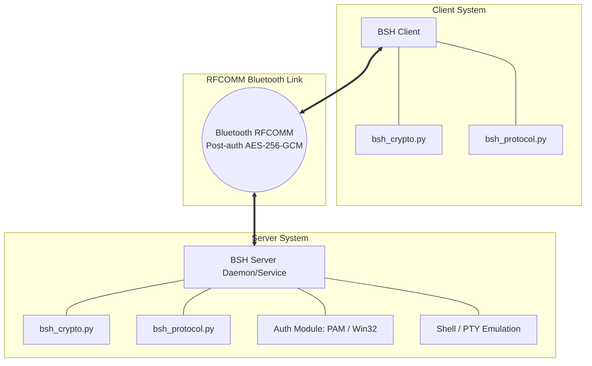
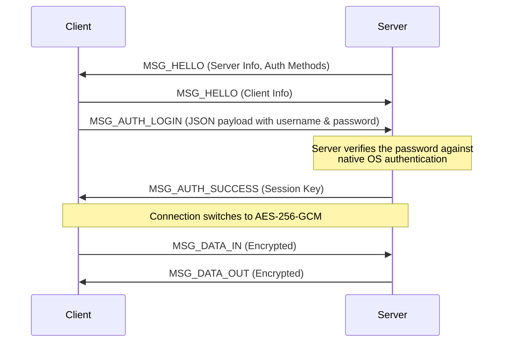

# System Architecture

OpenBSH is designed with a robust, cross-platform architecture that cleanly separates the core wire protocol and cryptography from platform-specific system integration, such as pseudo-terminals and service management.

## High-Level Component View

At its core, OpenBSH consists of a **Client**, a **Server**, and a shared **Protocol Layer**.

---

## Core Modules

OpenBSH relies on several key Python modules. To ensure maximum compatibility between Windows and Linux, the cryptographic and protocol logic is completely identical across platforms.

### 1. `bsh_protocol.py` (The Wire Protocol)
This file defines the strict packet structure used to communicate over Bluetooth. Because Bluetooth RFCOMM provides a reliable stream similar to TCP, `bsh_protocol.py` handles framing by defining the Start of Frame (`0xAA`), message types such as `MSG_HELLO` and `MSG_DATA_IN`, payloads, and checksum validation.

### 2. `bsh_crypto.py` (The Security Layer)
Once the server and client mutually authenticate, `bsh_crypto.py` is engaged. It implements **AES-256-GCM** encryption. All subsequent shell traffic is encrypted and authenticated. The GCM tag ensures that any tampering with the packet over the air is instantly detected and the connection is dropped.

### 3. Platform-Specific Server Logic
While the protocol is identical, interacting with the operating system requires highly tailored code.

#### **Windows Service (`bsh_server_service.py` & `bsh_service.py`)**
- **Service Management:** Uses `win32serviceutil` to run seamlessly in the background as a native Windows service.
- **Authentication:** Uses Windows `LogonUserW` via `ctypes` to validate credentials for the target Windows account.
- **Impersonation:** Uses Windows token-based process creation to spawn the current pipe-based `cmd.exe` shell under the authenticated user's context.

#### **Linux Daemon (`bsh_server_service.py` & `bsh_service.py`)**
- **Service Management:** Wrapped in a native `systemd` unit (`bsh.service`).
- **Authentication:** Uses the `python-pam` library to authenticate against PAM. If PAM fails or is not present, it falls back to parsing `/etc/shadow`.
- **Terminal Emulation:** Uses `pty.openpty()` to create a proper pseudo-terminal, then calls `os.fork()` and `os.execv()` along with `setuid` and `setgid` to drop root privileges and run the user's login shell.

---

## Authentication Mechanism

OpenBSH performs a hello exchange, a password authentication exchange, and then session key establishment.

1. **Hello Exchange:** The server sends `MSG_HELLO` first, then the client replies with its own `MSG_HELLO`. Together they advertise version and OS capability data that the client uses to adjust terminal behavior.
2. **Password Exchange:** The client sends a single `MSG_AUTH_LOGIN` packet carrying the username and plaintext password inside the BSH packet payload.
3. **Session Key Negotiation:** If authentication succeeds, the server generates a random AES-256 session key and sends it to the client inside `MSG_AUTH_SUCCESS`. From this moment, subsequent packet payloads are encrypted.

**Server-side verification by OS:**
- **Linux:** Authenticates via PAM (`python-pam`). Falls back to `/etc/shadow` if PAM is unavailable and the process has sufficient privileges. Drops to the authenticated user's UID and GID to spawn the shell.
- **Windows:** Calls `LogonUserW` to validate credentials and obtain a Windows user token, then uses `CreateProcessAsUser` to spawn `cmd.exe` under that user's context.

---

## Cross-Platform Pair Matrix (Dynamic Client Adaptation)

OpenBSH uses one shared packet protocol, but the clients employ a dynamic adaptive architecture. The runtime behavior shifts based on the target server's operating system, advertised via the `os` field in `MSG_HELLO`. The clients transition between raw PTY pass-through and local line-buffered history modes. The most important differences are in RFCOMM discovery, terminal editing, and whether `MSG_WINDOW_SIZE` changes an actual PTY.

| Pair | RFCOMM Discovery Path | Server `os` Value | Actual Shell Backend | Editing Authority | Resize Handling |
|---|---|---|---|---|---|
| Windows client -> Windows server | Windows SDP -> scan channels `1..12` -> manual | `Windows` | `cmd.exe` with pipes | Client-side line editor | Ignored by server |
| Windows client -> Linux server | Windows SDP -> scan channels `1..12` -> manual | `Linux` | PTY-backed login shell | Remote Linux PTY | Applied to PTY |
| Linux client -> Windows server | PyBluez SDP -> `sdptool` -> scan channels `1..12` -> manual | `Windows` | `cmd.exe` with pipes | Linux client uses Windows-specific local editing path | Ignored by server |
| Linux client -> Linux server | PyBluez SDP -> `sdptool` -> scan channels `1..12` -> manual | `Linux` | PTY-backed login shell | Remote Linux PTY | Applied to PTY |

### Design Notes

- Both servers currently advertise `features = ["pty", "signals", "password"]` in `MSG_HELLO`.
- On Linux this matches reality because the session is backed by `pty.openpty()`.
- On Windows this is only partially true: `MSG_INTERRUPT` is supported, but the shell is pipe-based and `MSG_WINDOW_SIZE` is accepted without changing a real terminal.
- The Linux server may auto-bind on RFCOMM channels `1..30` if its preferred channel is busy, so client-side channel scans are narrower than the Linux server's fallback bind range.
- Clients therefore key most of their interactive behavior off the remote `os` field rather than treating the `pty` feature flag as authoritative.
