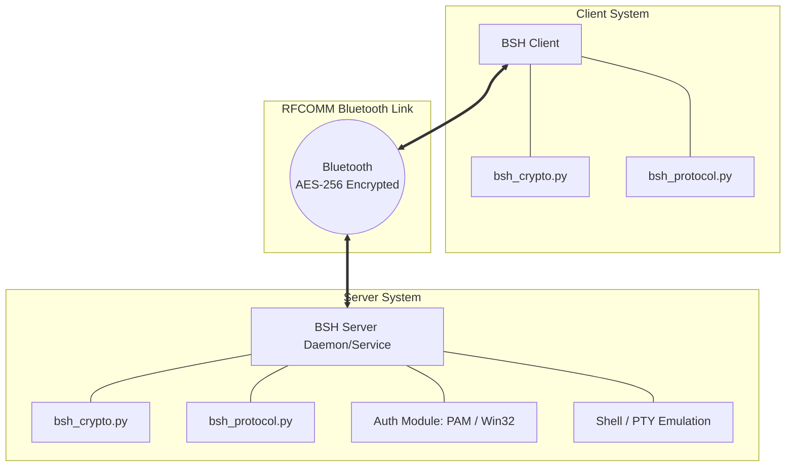
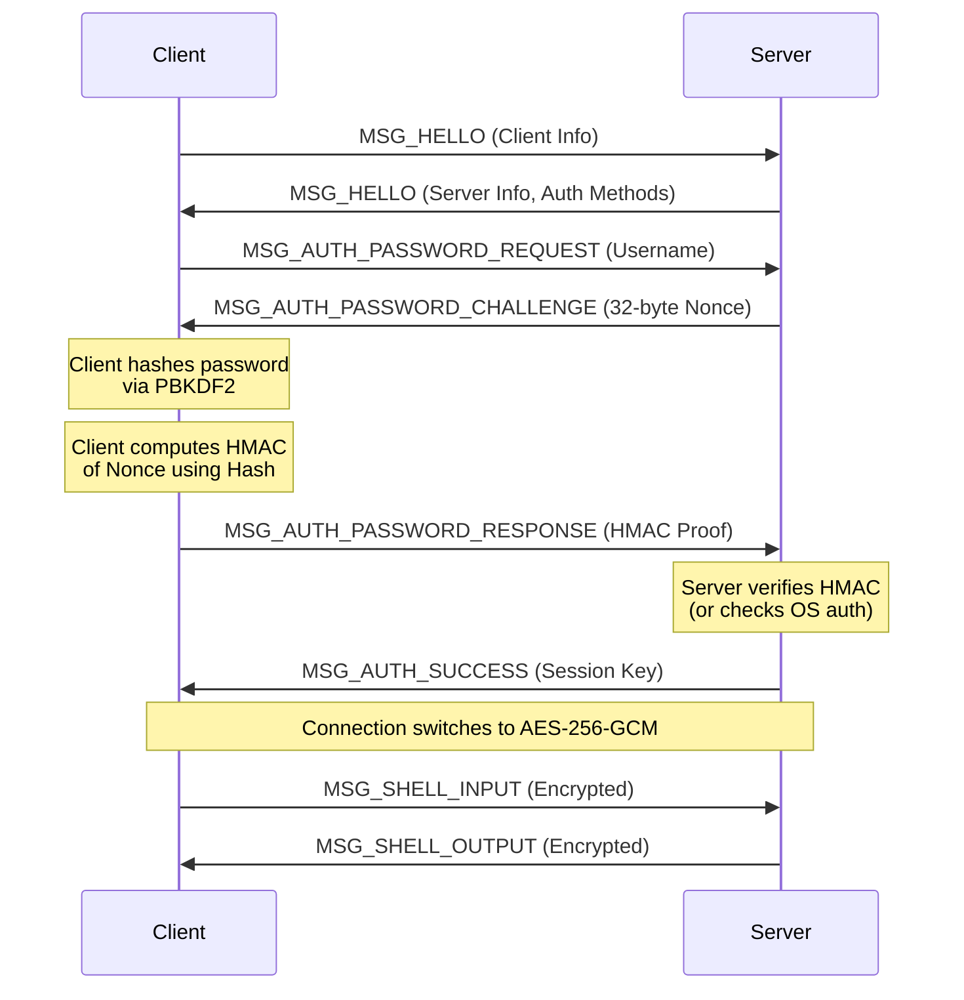

# System Architecture

OpenBSH is designed with a robust, cross-platform architecture that cleanly separates the core wire protocol and cryptography from platform-specific system integration (like pseudo-terminals and service management).

## High-Level Component View

At its core, OpenBSH consists of a **Client**, a **Server**, and a shared **Protocol Layer**.

---

## Core Modules

OpenBSH relies on several key Python modules. To ensure maximum compatibility between Windows and Linux, the cryptographic and protocol logic is completely identical across platforms.

### 1. `bsh_protocol.py` (The Wire Protocol)
This file defines the strict packet structure used to communicate over Bluetooth. Because Bluetooth RFCOMM provides a reliable stream (similar to TCP), `bsh_protocol.py` handles framing: defining the Start of Frame (`0xAA`), message types (e.g., `MSG_HELLO`, `MSG_SHELL_INPUT`), payloads, and checksum validation.

### 2. `bsh_crypto.py` (The Security Layer)
Once the server and client mutually authenticate, `bsh_crypto.py` is engaged. It implements **AES-256-GCM** encryption. All subsequent shell traffic is encrypted and authenticated. The GCM (Galois/Counter Mode) tag ensures that any tampering with the packet over the air is instantly detected and the connection is dropped.

### 3. Platform-Specific Server Logic
While the protocol is identical, interacting with the operating system requires highly tailored code.

#### **Windows Service (`bsh_server_service.py` & `bsh_service.py`)**
- **Service Management:** Uses `win32serviceutil` to run seamlessly in the background as a native Windows service.
- **Authentication:** Uses Windows `LogonUserW` (via `ctypes`) to validate user credentials against the local SAM or Active Directory domain.
- **Impersonation:** Uses `CreateProcessAsUser` to spawn `cmd.exe` or `powershell.exe` securely under the authenticated user's context.

#### **Linux Daemon (`bsh_server_service.py` & `bsh_service.py`)**
- **Service Management:** Wrapped in a native `systemd` unit (`bsh.service`).
- **Authentication:** Uses the `python-pam` library to authenticate against PAM (Pluggable Authentication Modules). If PAM fails or isn't present, it falls back to parsing `/etc/shadow`.
- **Terminal Emulation:** Uses `pty.openpty()` to create a proper pseudo-terminal, then calls `os.fork()` and `os.execv()` (along with `setuid`/`setgid`) to drop root privileges and run the user's default shell (e.g., `/bin/bash`).

---

## Authentication Mechanism

To prevent brute force and ensure secure key exchange, OpenBSH uses a challenge-response authentication mechanism.

1. **Hello Exchange:** Both sides advertise their version and OS capabilities. This is critical for clients to adjust their terminal emulation (e.g., disabling local echo if the server is Linux).
2. **Challenge/Response:** The server sends a random 32-byte nonce. The client must prove it knows the password by returning an HMAC of the nonce.
3. **Session Key Negotiation:** If the proof is valid, the server generates a random AES-256 session key and sends it to the client. From this moment, the socket is encrypted.
