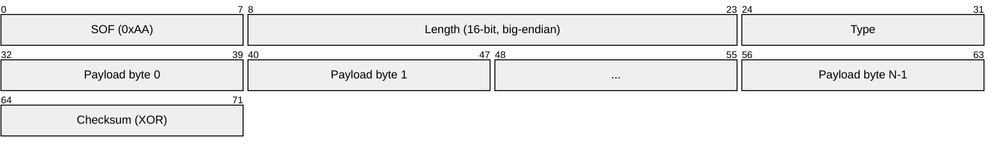
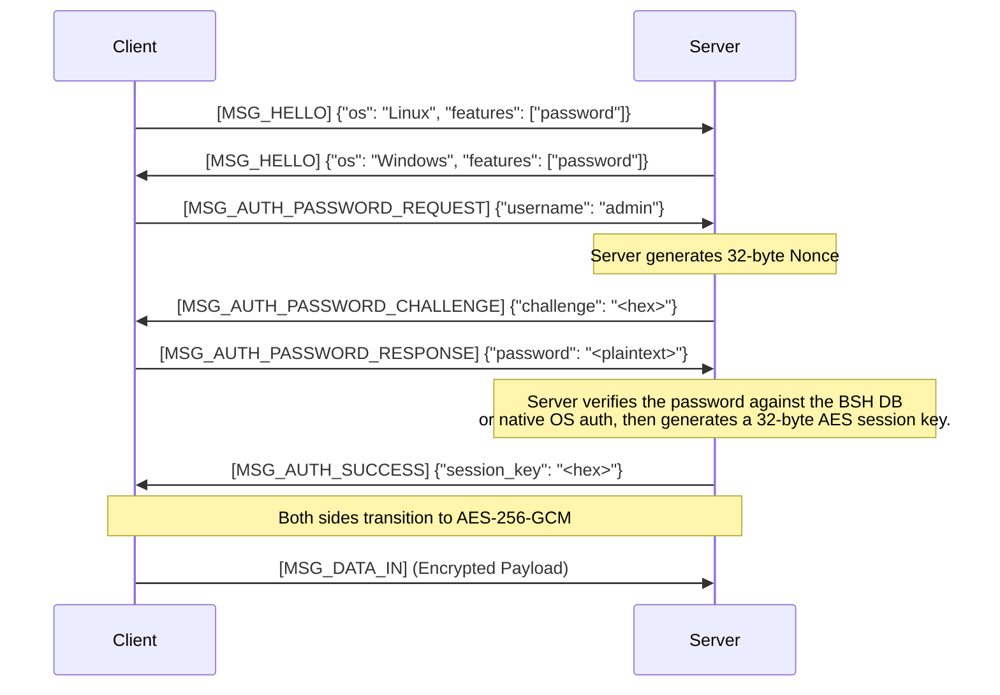

# Protocol & Security

OpenBSH relies on a highly specialized, custom Wire Protocol built directly over Bluetooth RFCOMM. This design ensures that communications are resilient to Bluetooth frame fragmentation, and that packet payloads are encrypted after authentication succeeds.

---

## Cryptography Design

All BSH traffic is secured using **AES-256-GCM** (Galois/Counter Mode). This provides both confidentiality (encryption) and authenticity (tamper-proofing).

### Key Derivation & Storage
- **Standalone Password Database:** When using the `bsh_password.py` database, passwords are never stored in plain text. They are hashed using **PBKDF2-HMAC-SHA256** with a randomly generated salt and `100,000` iterations.
- **Session Keys:** The encryption keys used for the data stream are ephemeral. A new 32-byte (256-bit) AES session key is generated securely by the server (`os.urandom`) upon every successful authentication.

### Wire Encryption Format
Once the session key is negotiated via `MSG_AUTH_SUCCESS`, both the client and server transition to encrypted mode. Every subsequent packet payload is replaced with an AES-GCM envelope.

```text
| IV (12 bytes) | AES-GCM Ciphertext (Variable) | Auth Tag (16 bytes) |
```

- **IV (Initialization Vector):** A unique 12-byte nonce generated for *every single packet* using `os.urandom`. This prevents replay attacks and ensures encryption uniqueness even if the identical payload is sent twice.
- **Ciphertext:** The fully encrypted original payload.
- **Auth Tag:** The 16-byte GCM authentication tag. The receiving side will immediately close the socket if this tag does not perfectly validate the ciphertext against the Session Key.

---

## Wire Protocol (`bsh_protocol.py`)

Because Bluetooth RFCOMM is a continuous stream, OpenBSH implements a custom framing protocol to define packet boundaries.

### Packet Structure

Every OpenBSH packet adheres to a strict binary format:



For a payload of length `N`, the on-wire byte order is:

```text
SOF | LEN_H | LEN_L | TYPE | PAYLOAD[0..N-1] | CHECKSUM
```

1. **SOF (Start of Frame):** A fixed byte (`0xAA`). If the receiver loses sync, it reads byte-by-byte until it finds `0xAA`.
2. **Length:** A 16-bit unsigned integer defining exactly how many bytes the payload contains.
3. **Message Type:** An 8-bit integer defining the purpose of the packet.
4. **Payload:** The actual data carried by the packet.
5. **Checksum:** A single-byte XOR checksum over `Length + Type + Payload`. The SOF byte is intentionally excluded.

### Message Types

The protocol defines the following core message types:

| Enum | Name | Description |
|---|---|---|
| `0x01` | `MSG_HELLO` | Initial capability and OS exchange. |
| `0x02` | `MSG_DISCONNECT` | Clean disconnect request. |
| `0x03` | `MSG_KEEPALIVE` | Keepalive packet. |
| `0x07` | `MSG_AUTH_SUCCESS` | Server sends authentication success and the AES session key. |
| `0x08` | `MSG_AUTH_FAILURE` | Server sends an authentication or protocol error. |
| `0x09` | `MSG_AUTH_PASSWORD_REQUEST` | Client begins password authentication. |
| `0x0A` | `MSG_AUTH_PASSWORD_CHALLENGE` | Server sends a random challenge. |
| `0x0B` | `MSG_AUTH_PASSWORD_RESPONSE` | Client sends the password-auth response payload. |
| `0x10` | `MSG_DATA_IN` | Client sends shell input. |
| `0x11` | `MSG_DATA_OUT` | Server sends shell stdout. |
| `0x12` | `MSG_DATA_ERR` | Server sends shell stderr. |
| `0x20` | `MSG_INTERRUPT` | Client requests a shell interrupt. |
| `0x21` | `MSG_WINDOW_SIZE` | Client sends terminal size information. |

---

## The Authentication Flow

The authentication flow is a critical component of OpenBSH. The current implementation performs a challenge step and then sends a password response payload that the server verifies against the BSH password database or the native OS authentication path.



### OS Authentication Fallback
If the user does not exist in the standalone database, the server falls back to native OS authentication (PAM on Linux, `LogonUserW` on Windows).

Important: the current client/server implementation does not perform an extra Diffie-Hellman or RSA exchange before OS authentication. The password is sent in the `MSG_AUTH_PASSWORD_RESPONSE` payload before the AES session key becomes active. The surrounding Bluetooth pairing and transport behavior therefore matter to the threat model.
