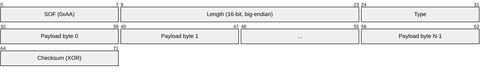
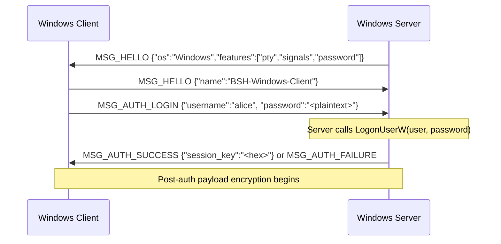
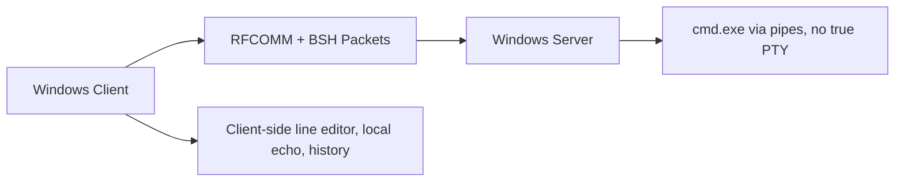
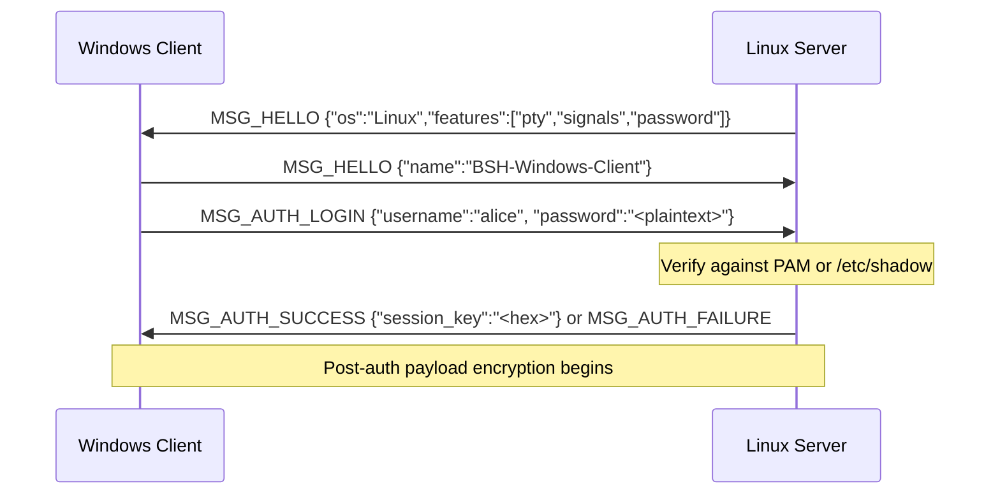
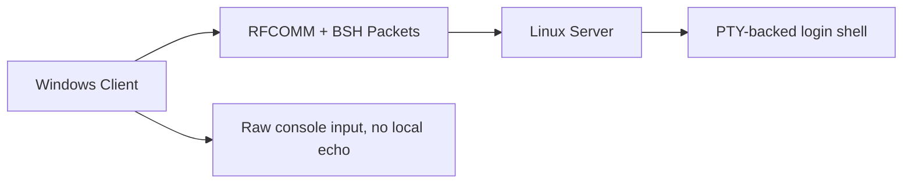
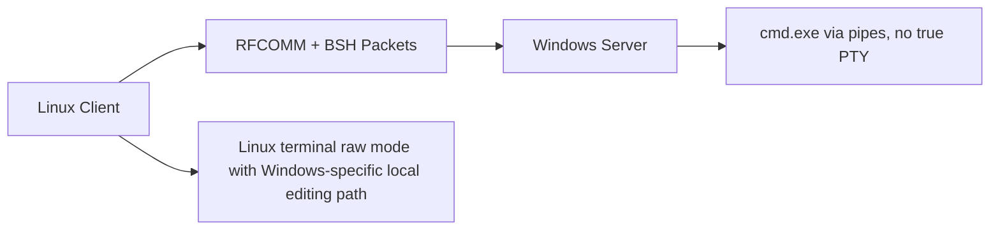
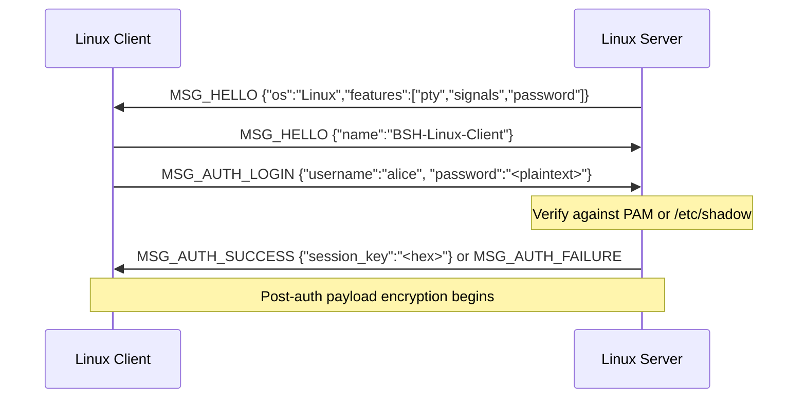
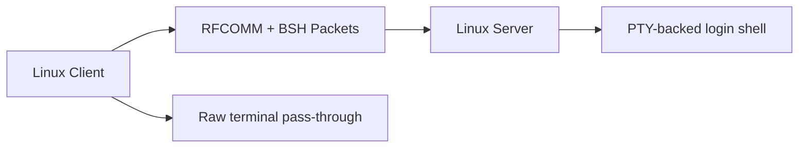

# Protocol & Security

OpenBSH relies on a custom wire protocol built directly over Bluetooth RFCOMM. This design ensures that communications remain resilient to Bluetooth frame fragmentation and that packet payloads are encrypted after authentication succeeds.

---

## Cryptography Design

All BSH traffic is secured using **AES-256-GCM**. This provides both confidentiality and authenticity.

### Key Derivation & Storage
- **PBKDF2 Helper:** The shared crypto module includes a PBKDF2-HMAC-SHA256 helper with a randomly generated salt and `100,000` iterations. In the current release, neither server uses a standalone BSH password database, so native OS authentication is the active path.
- **Session Keys:** The encryption keys used for the data stream are ephemeral. A new 32-byte (256-bit) AES session key is generated securely by the server via `os.urandom()` upon every successful authentication.

### Wire Encryption Format
Once the session key is negotiated via `MSG_AUTH_SUCCESS`, both the client and server transition to encrypted mode. Every subsequent packet payload is replaced with an AES-GCM envelope.

```text
| IV (12 bytes) | AES-GCM Ciphertext (Variable) | Auth Tag (16 bytes) |
```

- **IV (Initialization Vector):** A unique 12-byte nonce generated for every packet using `os.urandom()`.
- **Ciphertext:** The fully encrypted original payload.
- **Auth Tag:** The 16-byte GCM authentication tag. The receiving side closes the socket if the tag does not validate against the session key.

---

## Wire Protocol (`bsh_protocol.py`)

Because Bluetooth RFCOMM is a continuous stream, OpenBSH implements a custom framing protocol to define packet boundaries.

### Packet Structure

Every OpenBSH packet adheres to a strict binary format:



For a payload of length `N`, the on-wire byte order is:

```text
SOF | LEN_H | LEN_L | TYPE | PAYLOAD[0..N-1] | CHECKSUM
```

1. **SOF (Start of Frame):** A fixed byte (`0xAA`). If the receiver loses sync, it reads byte-by-byte until it finds `0xAA`.
2. **Length:** A 16-bit unsigned integer defining exactly how many bytes the payload contains.
3. **Message Type:** An 8-bit integer defining the purpose of the packet.
4. **Payload:** The actual data carried by the packet.
5. **Checksum:** A single-byte XOR checksum over `Length + Type + Payload`. The SOF byte is intentionally excluded.

### Message Types

The protocol defines the following core message types:

| Enum | Name | Description |
|---|---|---|
| `0x01` | `MSG_HELLO` | Initial capability and OS exchange. |
| `0x02` | `MSG_DISCONNECT` | Clean disconnect request. |
| `0x03` | `MSG_KEEPALIVE` | Keepalive packet. |
| `0x07` | `MSG_AUTH_SUCCESS` | Server sends authentication success and the AES session key. |
| `0x08` | `MSG_AUTH_FAILURE` | Server sends an authentication or protocol error. |
| `0x09` | `MSG_AUTH_LOGIN` | Client sends username and plaintext password for authentication. |
| `0x10` | `MSG_DATA_IN` | Client sends shell input. |
| `0x11` | `MSG_DATA_OUT` | Server sends shell stdout. |
| `0x12` | `MSG_DATA_ERR` | Server sends shell stderr. |
| `0x15` | `MSG_WINDOW_RESIZE` | Alias for `MSG_WINDOW_SIZE` - client requests a PTY resize. Handled identically to `0x21` by both Linux and Windows servers. |
| `0x20` | `MSG_INTERRUPT` | Client requests a shell interrupt (`Ctrl+C`). |
| `0x21` | `MSG_WINDOW_SIZE` | Client sends terminal size information (`rows x cols`). |

---

## The Authentication Flow

The current wire protocol performs a simplified, single-step authentication. The client prompts for a password and sends a single `MSG_AUTH_LOGIN` packet containing a JSON payload:

```json
{"username": "<name>", "password": "<plaintext>"}
```

### Server-Side Authentication

The important behavioral difference is the server OS:

- **Linux server:**
  Verifies credentials via PAM (`python-pam`). If PAM is unavailable, the server falls back to `/etc/shadow` directly. The process must run as root to call `setuid()` and `setgid()` and impersonate the authenticated user for the shell session.
- **Windows server:**
  Calls `LogonUserW` via `ctypes` to validate the credentials against the Windows local account database and obtain a user token. The service must run as `LocalSystem` to call `CreateProcessAsUser` with that token.

### Practical Consequence

- **All stock client pairings use plaintext password submission inside `MSG_AUTH_LOGIN`.**
- **The stock client paths all rely on native OS password verification before session encryption starts.**

Important: the current client/server implementation does not perform an extra Diffie-Hellman or RSA exchange before OS authentication. The password is sent in the `MSG_AUTH_LOGIN` payload before the AES session key becomes active. The surrounding Bluetooth pairing and transport behavior therefore matter to the threat model.

---

## Dynamic Adaptive Session Behavior

The packet framing, message IDs, and AES-GCM payload format are shared across all supported client/server combinations. The practical differences appear after `MSG_HELLO`, when the clients dynamically detect the server's `os` and adapt their input handling model for terminal editing, resize packets, and shell I/O.

### Shared Behavior Across All Four Pairs

- The server sends `MSG_HELLO` first and the client replies with its own `MSG_HELLO`.
- The client hello includes `name` and `version`.
- The server then expects `MSG_AUTH_LOGIN` with the `username` and `password`.
- The server accepts `MSG_AUTH_LOGIN`, and if successful, sends `MSG_AUTH_SUCCESS` with the session key.
- After `MSG_AUTH_SUCCESS`, both sides encrypt packet payloads with AES-256-GCM.
- `MSG_KEEPALIVE`, `MSG_INTERRUPT`, and `MSG_DISCONNECT` are valid on every path.

### Windows Client -> Windows Server





- Transport setup:
  The Windows client uses raw Winsock `AF_BTH` RFCOMM sockets.
- Channel discovery:
  It tries Windows SDP lookup first, then scans RFCOMM channels `1..12`, then falls back to manual channel entry.
- Hello semantics:
  The Windows server reports `os = "Windows"` and currently advertises `features = ["pty", "signals", "password"]`.
- Auth semantics:
  The current Windows client sends the password in plaintext JSON inside the initial authentication request.
- Server-side verification:
  The Windows server calls `LogonUserW` with the provided plaintext password to obtain a Windows token.
- Consequence:
  This path performs native OS password authentication before AES session encryption begins.
- Important quirk:
  The Windows server advertises `pty`, but the actual shell path is pipe-based `cmd.exe` rather than a true PTY.
- Input model:
  The Windows client switches to local line editing. Characters are echoed locally, command history is local, and completed lines are sent to the server.
- Output model:
  The client suppresses the echoed command coming back from the Windows shell because it already rendered that line locally.
- Resize behavior:
  The client still sends `MSG_WINDOW_SIZE`, but the Windows server accepts and ignores it.
- Interrupt behavior:
  `MSG_INTERRUPT` becomes a `^C` write to the shell input pipe.

### Windows Client -> Linux Server





- Transport setup:
  The Windows client still uses raw Winsock `AF_BTH` RFCOMM sockets with the same SDP -> scan -> manual fallback flow.
- Hello semantics:
  The Linux server reports `os = "Linux"` and advertises `features = ["pty", "signals", "password"]`.
- Auth semantics:
  The Linux server expects the password in the `MSG_AUTH_LOGIN` payload, and the stock Windows client sends it as plaintext JSON.
- Server-side verification:
  The Linux server verifies the password against PAM or `/etc/shadow`.
- Consequence:
  This path still performs native OS password authentication before AES session encryption begins.
- Input model:
  The Windows client disables local echo and forwards keystrokes toward the remote PTY instead of doing local line editing.
- Output model:
  The Linux PTY performs canonical editing, echo, and cursor behavior, so the session behaves much closer to SSH.
- Resize behavior:
  The client sends `MSG_WINDOW_SIZE` immediately after entering interactive mode and on later console-size changes; the Linux server applies the new size to the PTY.
- Interrupt behavior:
  `MSG_INTERRUPT` becomes a PTY-side `Ctrl+C`.

### Linux Client -> Windows Server




- Transport setup:
  The Linux client uses Python `socket.AF_BLUETOOTH` / `BTPROTO_RFCOMM`.
- Channel discovery:
  It tries PyBluez SDP lookup first when available, then `sdptool`, then RFCOMM channel scan across `1..12`, then manual entry.
- Hello semantics:
  The Windows server again reports `os = "Windows"` and advertises `["pty", "signals", "password"]`, even though size changes are not applied to a real PTY.
- Auth semantics:
  The Linux client sends the password as plaintext JSON in the `MSG_AUTH_LOGIN` payload.
- Server-side verification:
  The Windows server depends on `LogonUserW`.
- Consequence:
  The Linux client's raw terminal behavior does not change the authentication model; this path is still plaintext-password authentication before session encryption starts.
- Input model:
  Although the Linux client enters terminal raw mode, it does not behave like a pure pass-through session when the remote OS is Windows. It switches into a Windows-specific local editing path with a local buffer and history handling.
- Output model:
  The remote Windows shell remains pipe-based, so editing fidelity differs from a Linux PTY-backed session.
- Resize behavior:
  The Linux client sends `MSG_WINDOW_SIZE` on connect and on `SIGWINCH`, but the Windows server ignores those packets.
- Interrupt behavior:
  `MSG_INTERRUPT` is translated into `^C` on the server side.

### Linux Client -> Linux Server





- Transport setup:
  The Linux client uses Python `AF_BLUETOOTH` RFCOMM sockets and the PyBluez SDP -> `sdptool` -> scan -> manual discovery chain.
- Hello semantics:
  The Linux server reports `os = "Linux"` and `features = ["pty", "signals", "password"]`.
- Auth semantics:
  Even on the most Linux-native path, the stock Linux client still sends plaintext password JSON because the server does not publish salt in the protocol.
- Server-side verification:
  The Linux server verifies the supplied password against PAM or `/etc/shadow`.
- Consequence:
  The current Linux-to-Linux path is operationally plaintext-password auth before AES activation.
- Input model:
  The Linux client runs in raw terminal mode and forwards keystrokes character-by-character.
- Output model:
  The Linux PTY handles echo, backspace, cursor motion, line discipline, and full-screen terminal applications.
- Resize behavior:
  The client sends an initial `MSG_WINDOW_SIZE` and propagates later terminal resizes; the Linux server applies them with `TIOCSWINSZ`.
- Interrupt behavior:
  `MSG_INTERRUPT` is forwarded to the PTY-backed shell.

### Compatibility Matrix

| Pair | Auth Payload Sent By Stock Client | Server-Side Auth Reality | Remote Shell Model | `MSG_WINDOW_SIZE` | Notes |
|---|---|---|---|---|---|
| Windows client -> Windows server | `{"password":"<plaintext>"}` | `LogonUserW` token acquisition | `cmd.exe` via pipes | Sent, ignored | Native OS password auth before AES activation |
| Windows client -> Linux server | `{"password":"<plaintext>"}` | PAM or `/etc/shadow` fallback | Linux PTY | Sent, applied | Native OS password auth before AES activation |
| Linux client -> Windows server | `{"password":"<plaintext>"}` | `LogonUserW` token acquisition | `cmd.exe` via pipes | Sent, ignored | Client OS changes terminal behavior, not auth semantics |
| Linux client -> Linux server | `{"password":"<plaintext>"}` | PAM or `/etc/shadow` fallback | Linux PTY | Sent, applied | Most complete PTY path, but still plaintext-password auth today |
