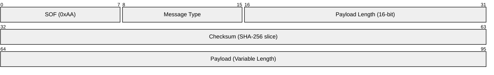
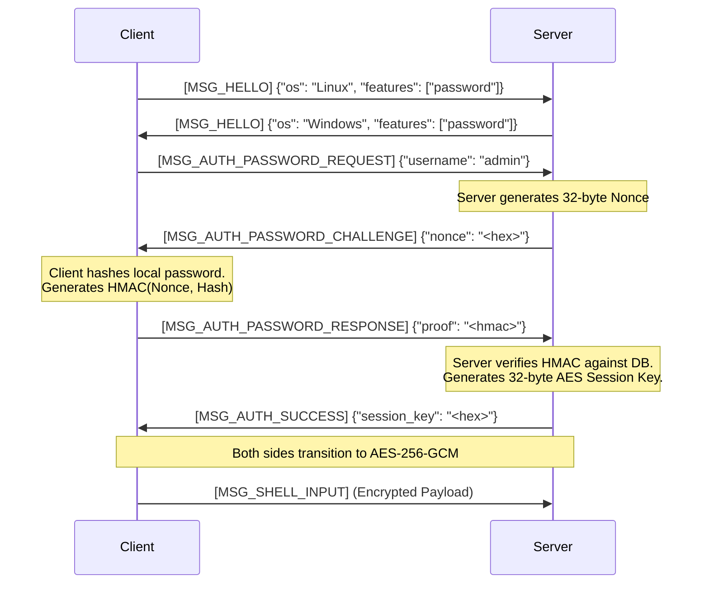

# Protocol & Security

OpenBSH relies on a highly specialized, custom Wire Protocol built directly over Bluetooth RFCOMM. This design ensures that all communications are resilient to Bluetooth frame fragmentation and are fully encrypted before transmission.

---

## Cryptography Design

All BSH traffic is secured using **AES-256-GCM** (Galois/Counter Mode). This provides both confidentiality (encryption) and authenticity (tamper-proofing).

### Key Derivation & Storage
- **Standalone Password Database:** When using the `bsh_password.py` database, passwords are never stored in plain text. They are hashed using **PBKDF2 HMAC-SHA256** with a randomly generated 16-byte salt and `100,000` iterations. 
- **Session Keys:** The encryption keys used for the data stream are ephemeral. A new 32-byte (256-bit) AES session key is generated securely by the Server (`os.urandom`) upon every successful authentication.

### Wire Encryption Format
Once the session key is negotiated via `MSG_AUTH_SUCCESS`, both the client and server transition to encrypted mode. Every subsequent packet payload is replaced with an AES-GCM envelope.

```text
| IV (12 bytes) | AES-GCM Ciphertext (Variable) | Auth Tag (16 bytes) |
```

- **IV (Initialization Vector):** A unique 12-byte nonce generated for *every single packet* using `os.urandom`. This prevents replay attacks and ensures encryption uniqueness even if the identical payload is sent twice.
- **Ciphertext:** The fully encrypted original payload.
- **Auth Tag:** The 16-byte GCM authentication tag. The receiving side will immediately close the socket if this tag does not perfectly validate the ciphertext against the Session Key.

---

## Wire Protocol (`bsh_protocol.py`)

Because Bluetooth RFCOMM is a continuous stream, OpenBSH implements a custom framing protocol to define packet boundaries.

### Packet Structure

Every OpenBSH packet adheres to a strict binary format:



1. **SOF (Start of Frame):** A fixed byte (`0xAA`). If the receiver loses sync, it reads byte-by-byte until it finds `0xAA`.
2. **Message Type:** An 8-bit integer defining the purpose of the packet (e.g., `0x07` for `MSG_SHELL_INPUT`).
3. **Payload Length:** A 16-bit unsigned short defining exactly how many bytes the payload contains.
4. **Checksum:** The first 4 bytes of the SHA-256 hash of the payload. Ensures data integrity over the noisy RF airwaves (prior to encryption being established).
5. **Payload:** The actual data (JSON for control messages, raw bytes for shell I/O).

### Message Types

The protocol defines the following core message types:

| Enum | Name | Description |
|---|---|---|
| `0x01` | `MSG_HELLO` | Initial exchange containing OS info and supported features. |
| `0x02` | `MSG_ERROR` | Fatal error messages (e.g., Auth failed, PTY crashed). |
| `0x03` | `MSG_AUTH_SUCCESS` | Server sends the AES Session Key to the client. |
| `0x07` | `MSG_SHELL_INPUT` | Client sends keystrokes/data to the Server. |
| `0x08` | `MSG_SHELL_OUTPUT` | Server sends terminal output to the Client. |
| `0x09` | `MSG_WINDOW_SIZE` | Client informs the Server of a terminal resize event. |
| `0x0A` | `MSG_AUTH_PASSWORD_REQUEST` | Client requests password auth for a specific username. |
| `0x0B` | `MSG_AUTH_PASSWORD_CHALLENGE`| Server sends a 32-byte nonce for the client to sign. |
| `0x0C` | `MSG_AUTH_PASSWORD_RESPONSE` | Client sends the HMAC-SHA256 proof. |
| `0x0D` | `MSG_KEEPALIVE` | Client pings the server to keep the RFCOMM socket open. |

---

## The Authentication Flow

The Authentication Flow is a critical component of OpenBSH. It uses a Zero-Knowledge proof mechanism for standalone passwords to ensure the password is never transmitted over the air.



### OS Authentication Fallback
If the user does not exist in the standalone database, the server will fall back to native OS authentication (PAM on Linux, `LogonUserW` on Windows). 

Because OS authentication APIs require the plaintext password, the Client detects this failure in the Zero-Knowledge step, establishes a temporary Diffie-Hellman or RSA encrypted channel (or relies on the secure properties of paired Bluetooth depending on configuration), and transmits the plaintext password directly to the OS Auth Module for verification.
