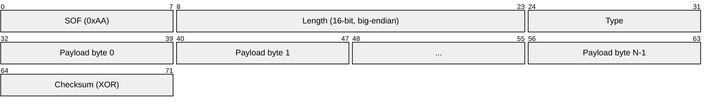
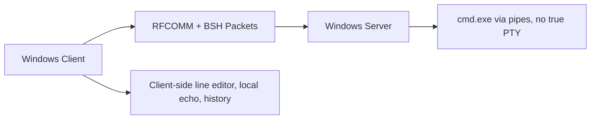
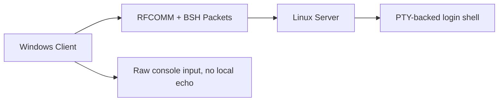
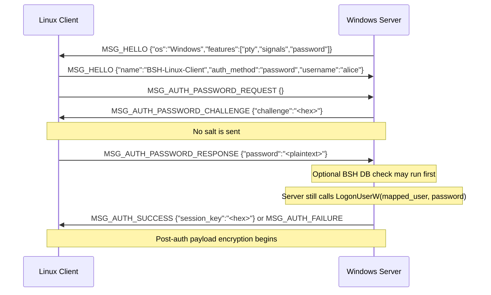
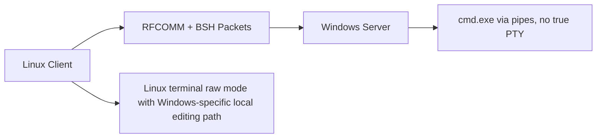
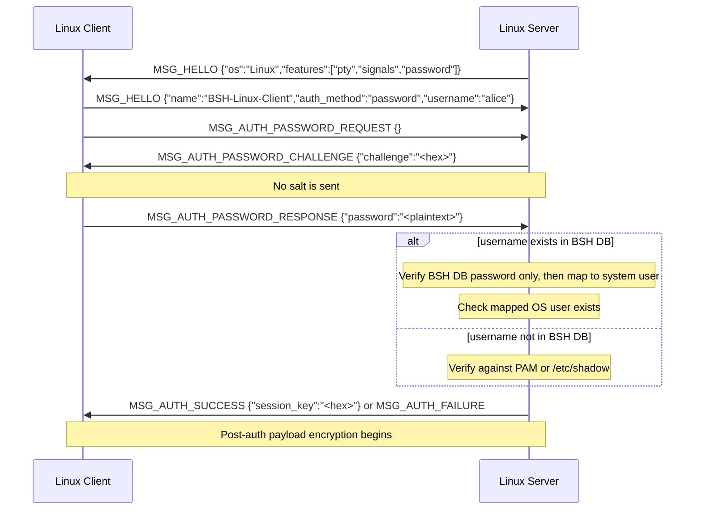
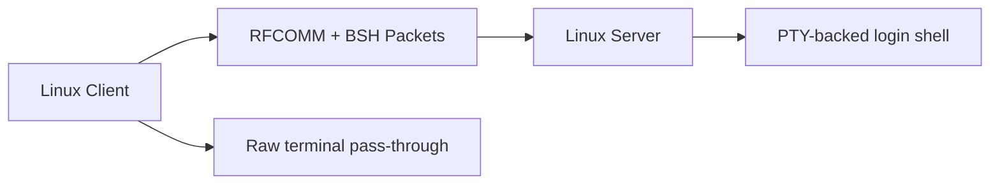

# Protocol & Security

OpenBSH relies on a highly specialized, custom Wire Protocol built directly over Bluetooth RFCOMM. This design ensures that communications are resilient to Bluetooth frame fragmentation, and that packet payloads are encrypted after authentication succeeds.

---

## Cryptography Design

All BSH traffic is secured using **AES-256-GCM** (Galois/Counter Mode). This provides both confidentiality (encryption) and authenticity (tamper-proofing).

### Key Derivation & Storage
- **Standalone Password Database:** When using the `bsh_password.py` database, passwords are never stored in plain text. They are hashed using **PBKDF2-HMAC-SHA256** with a randomly generated salt and `100,000` iterations.
- **Session Keys:** The encryption keys used for the data stream are ephemeral. A new 32-byte (256-bit) AES session key is generated securely by the server (`os.urandom`) upon every successful authentication.

### Wire Encryption Format
Once the session key is negotiated via `MSG_AUTH_SUCCESS`, both the client and server transition to encrypted mode. Every subsequent packet payload is replaced with an AES-GCM envelope.

```text
| IV (12 bytes) | AES-GCM Ciphertext (Variable) | Auth Tag (16 bytes) |
```

- **IV (Initialization Vector):** A unique 12-byte nonce generated for *every single packet* using `os.urandom`. This prevents replay attacks and ensures encryption uniqueness even if the identical payload is sent twice.
- **Ciphertext:** The fully encrypted original payload.
- **Auth Tag:** The 16-byte GCM authentication tag. The receiving side will immediately close the socket if this tag does not perfectly validate the ciphertext against the Session Key.

---

## Wire Protocol (`bsh_protocol.py`)

Because Bluetooth RFCOMM is a continuous stream, OpenBSH implements a custom framing protocol to define packet boundaries.

### Packet Structure

Every OpenBSH packet adheres to a strict binary format:



For a payload of length `N`, the on-wire byte order is:

```text
SOF | LEN_H | LEN_L | TYPE | PAYLOAD[0..N-1] | CHECKSUM
```

1. **SOF (Start of Frame):** A fixed byte (`0xAA`). If the receiver loses sync, it reads byte-by-byte until it finds `0xAA`.
2. **Length:** A 16-bit unsigned integer defining exactly how many bytes the payload contains.
3. **Message Type:** An 8-bit integer defining the purpose of the packet.
4. **Payload:** The actual data carried by the packet.
5. **Checksum:** A single-byte XOR checksum over `Length + Type + Payload`. The SOF byte is intentionally excluded.

### Message Types

The protocol defines the following core message types:

| Enum | Name | Description |
|---|---|---|
| `0x01` | `MSG_HELLO` | Initial capability and OS exchange. |
| `0x02` | `MSG_DISCONNECT` | Clean disconnect request. |
| `0x03` | `MSG_KEEPALIVE` | Keepalive packet. |
| `0x07` | `MSG_AUTH_SUCCESS` | Server sends authentication success and the AES session key. |
| `0x08` | `MSG_AUTH_FAILURE` | Server sends an authentication or protocol error. |
| `0x09` | `MSG_AUTH_PASSWORD_REQUEST` | Client begins password authentication. |
| `0x0A` | `MSG_AUTH_PASSWORD_CHALLENGE` | Server sends a random challenge. |
| `0x0B` | `MSG_AUTH_PASSWORD_RESPONSE` | Client sends the password-auth response payload. |
| `0x10` | `MSG_DATA_IN` | Client sends shell input. |
| `0x11` | `MSG_DATA_OUT` | Server sends shell stdout. |
| `0x12` | `MSG_DATA_ERR` | Server sends shell stderr. |
| `0x20` | `MSG_INTERRUPT` | Client requests a shell interrupt. |
| `0x21` | `MSG_WINDOW_SIZE` | Client sends terminal size information. |

---

## The Authentication Flow

The current wire protocol always performs a challenge step, but the stock clients do not use that challenge to construct an HMAC proof. They prompt for a password and send:

```json
{"password": "<plaintext>"}
```

inside `MSG_AUTH_PASSWORD_RESPONSE`.

### What The Challenge Does Today

- Every server currently sends `MSG_AUTH_PASSWORD_CHALLENGE` with only a `challenge` field.
- No server currently sends the per-user PBKDF2 salt in that packet.
- Both `bsh_password.py` implementations contain helper code for HMAC proof generation and verification.
- The stock Linux and Windows clients do not call those helpers.
- Because the salt never travels over the wire, a stock client cannot derive the proof from the protocol alone.

In other words, the current challenge packet adds a freshness token to the exchange, but it is not enough by itself to enable the password-proof path for stock clients.

### Server-Side Authentication Split

The important behavioral difference is not the client OS, but the server OS:

- **Linux server:**
  If the username exists in the BSH password database, the server can authenticate against that database and only checks that the mapped OS user exists before spawning the shell. If the username is not in the BSH database, it falls back to PAM or `/etc/shadow`.
- **Windows server:**
  Even if the username exists in the BSH password database, the server still calls `LogonUserW` for the mapped Windows account in order to obtain a usable Windows token. That means the live path still depends on the plaintext password field being present and valid for the mapped Windows account.

### Practical Consequence

- **All stock client pairings use plaintext password submission inside `MSG_AUTH_PASSWORD_RESPONSE`.**
- **The HMAC proof path exists in helper code, but it is not reachable through the current stock client workflow.**
- **Windows server authentication is stricter in practice because token creation still requires Windows password verification after any BSH-database check.**

Important: the current client/server implementation does not perform an extra Diffie-Hellman or RSA exchange before OS authentication. The password is sent in the `MSG_AUTH_PASSWORD_RESPONSE` payload before the AES session key becomes active. The surrounding Bluetooth pairing and transport behavior therefore matter to the threat model.

---

## Pair-Specific Session Behavior

The packet framing, message IDs, challenge step, and AES-GCM payload format are shared across all supported client/server combinations. The practical differences appear after `MSG_HELLO`, when the peers decide how to handle terminal editing, resize packets, and shell I/O.

### Shared Behavior Across All Four Pairs

- The server sends `MSG_HELLO` first and the client replies with its own `MSG_HELLO`.
- The client hello includes `name`, `version`, `auth_method`, and `username`.
- The current clients only use `auth_method = "password"`.
- The server then expects `MSG_AUTH_PASSWORD_REQUEST`, returns `MSG_AUTH_PASSWORD_CHALLENGE` with only a random `challenge`, accepts `MSG_AUTH_PASSWORD_RESPONSE`, and finally sends `MSG_AUTH_SUCCESS` with the session key.
- After `MSG_AUTH_SUCCESS`, both sides encrypt packet payloads with AES-256-GCM.
- `MSG_KEEPALIVE`, `MSG_INTERRUPT`, and `MSG_DISCONNECT` are valid on every path.
- The stock clients send plaintext password JSON in `MSG_AUTH_PASSWORD_RESPONSE`; they do not send `proof`.

### Windows Client -> Windows Server




- Transport setup:
  The Windows client uses raw Winsock `AF_BTH` RFCOMM sockets.
- Channel discovery:
  It tries Windows SDP lookup first, then scans RFCOMM channels `1..12`, then falls back to manual channel entry.
- Hello semantics:
  The Windows server reports `os = "Windows"` and currently advertises `features = ["pty", "signals", "password"]`.
- Auth semantics:
  The challenge packet contains only `challenge`; no salt is transmitted. The current Windows client responds with plaintext password JSON.
- Server-side verification:
  If the BSH password database contains the username, the server may verify that database entry first, but it still has to call `LogonUserW` with the provided plaintext password to obtain a Windows token.
- Consequence:
  A custom HMAC-proof-only client would still not be enough for the current Windows server path unless the server were changed, because the Windows token step still needs the password.
- Important quirk:
  The Windows server advertises `pty`, but the actual shell path is pipe-based `cmd.exe` rather than a true PTY.
- Input model:
  The Windows client switches to local line editing. Characters are echoed locally, command history is local, and completed lines are sent to the server.
- Output model:
  The client suppresses the echoed command coming back from the Windows shell because it already rendered that line locally.
- Resize behavior:
  The client still sends `MSG_WINDOW_SIZE`, but the Windows server accepts and ignores it.
- Interrupt behavior:
  `MSG_INTERRUPT` becomes a `^C` write to the shell input pipe.

### Windows Client -> Linux Server




- Transport setup:
  The Windows client still uses raw Winsock `AF_BTH` RFCOMM sockets with the same SDP -> scan -> manual fallback flow.
- Hello semantics:
  The Linux server reports `os = "Linux"` and advertises `features = ["pty", "signals", "password"]`.
- Auth semantics:
  The Linux server also sends only `challenge`, not salt, so the stock Windows client still sends plaintext password JSON.
- Server-side verification:
  If the username exists in the Linux BSH password database, Linux can authenticate there without requiring the mapped OS password. If the username is not in that database, Linux falls back to PAM or `/etc/shadow`.
- Consequence:
  Linux has helper support for proof verification, but the stock Windows client cannot use it because the protocol does not send salt.
- Input model:
  The Windows client disables local echo and forwards keystrokes toward the remote PTY instead of doing local line editing.
- Output model:
  The Linux PTY performs canonical editing, echo, and cursor behavior, so the session behaves much closer to SSH.
- Resize behavior:
  The client sends `MSG_WINDOW_SIZE` immediately after entering interactive mode and on later console-size changes; the Linux server applies the new size to the PTY.
- Interrupt behavior:
  `MSG_INTERRUPT` becomes a PTY-side `Ctrl+C`.

### Linux Client -> Windows Server





- Transport setup:
  The Linux client uses Python `socket.AF_BLUETOOTH` / `BTPROTO_RFCOMM`.
- Channel discovery:
  It tries PyBluez SDP lookup first when available, then `sdptool`, then RFCOMM channel scan, then manual entry.
- Hello semantics:
  The Windows server again reports `os = "Windows"` and advertises `["pty", "signals", "password"]`, even though size changes are not applied to a real PTY.
- Auth semantics:
  The Linux client receives only a `challenge` field and still sends `{"password":"<plaintext>"}`.
- Server-side verification:
  As with the Windows-client path, the Windows server still depends on `LogonUserW` after any optional BSH-database check.
- Consequence:
  The Linux client's raw terminal behavior does not change the authentication model; this path is still plaintext-password authentication before session encryption starts.
- Input model:
  Although the Linux client enters terminal raw mode, it does not behave like a pure pass-through session when the remote OS is Windows. It switches into a Windows-specific local editing path with a local buffer and history handling.
- Output model:
  The remote Windows shell remains pipe-based, so editing fidelity differs from a Linux PTY-backed session.
- Resize behavior:
  The Linux client sends `MSG_WINDOW_SIZE` on connect and on `SIGWINCH`, but the Windows server ignores those packets.
- Interrupt behavior:
  `MSG_INTERRUPT` is translated into `^C` on the server side.

### Linux Client -> Linux Server





- Transport setup:
  The Linux client uses Python `AF_BLUETOOTH` RFCOMM sockets and the PyBluez SDP -> `sdptool` -> scan -> manual discovery chain.
- Hello semantics:
  The Linux server reports `os = "Linux"` and `features = ["pty", "signals", "password"]`.
- Auth semantics:
  Even on the most Linux-native path, the stock Linux client still sends plaintext password JSON because the server does not publish salt in the protocol.
- Server-side verification:
  Linux can authenticate BSH-database users without rechecking the mapped OS password, but only the helper code knows how to validate `proof`, and the stock client never sends it.
- Consequence:
  The current Linux-to-Linux path is operationally plaintext-password auth before AES activation, even though the server code contains dormant support for proof verification.
- Input model:
  The Linux client runs in raw terminal mode and forwards keystrokes character-by-character.
- Output model:
  The Linux PTY handles echo, backspace, cursor motion, line discipline, and full-screen terminal applications.
- Resize behavior:
  The client sends an initial `MSG_WINDOW_SIZE` and propagates later terminal resizes; the Linux server applies them with `TIOCSWINSZ`.
- Interrupt behavior:
  `MSG_INTERRUPT` is forwarded to the PTY-backed shell.

### Compatibility Matrix

| Pair | Auth Response Sent By Stock Client | Server-Side Auth Reality | Remote Shell Model | `MSG_WINDOW_SIZE` | Notes |
|---|---|---|---|---|---|
| Windows client -> Windows server | `{"password":"<plaintext>"}` | Optional BSH DB check plus mandatory `LogonUserW` token acquisition | `cmd.exe` via pipes | Sent, ignored | No salt on wire; proof path not usable by stock client |
| Windows client -> Linux server | `{"password":"<plaintext>"}` | BSH DB check or PAM/shadow fallback | Linux PTY | Sent, applied | Linux could verify proof, but stock client cannot compute one from the protocol |
| Linux client -> Windows server | `{"password":"<plaintext>"}` | Optional BSH DB check plus mandatory `LogonUserW` token acquisition | `cmd.exe` via pipes | Sent, ignored | Client OS changes terminal behavior, not auth semantics |
| Linux client -> Linux server | `{"password":"<plaintext>"}` | BSH DB check or PAM/shadow fallback | Linux PTY | Sent, applied | Most complete PTY path, but still plaintext-password auth today |
